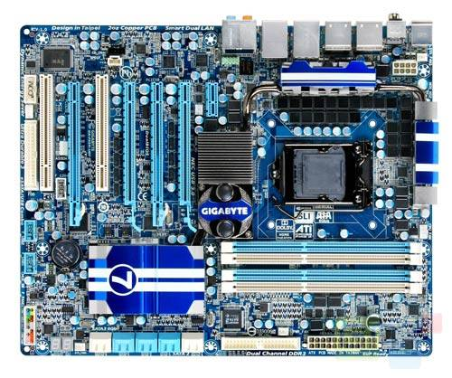

[**Gigabyte تطرح motherboard  بمواصفات خارقة**](https://www.it-scoop.com/2010/02/gigabyte-%d8%aa%d8%b7%d8%b1%d8%ad-mother-board-%d8%a8%d9%85%d9%88%d8%a7%d8%b5%d9%81%d8%a7%d8%aa-%d8%ae%d8%a7%d8%b1%d9%82%d8%a9/)

تحت تسلسل GA-P55A-UD7 أتمت شركة Gigabyte ملء كتيبها التسويقي بآخر منتج لها ببطاقة أم motherboard بمميزات  تسيل اللعاب

بشكل ATX و بأبعاد تقدر بـ (30.5 × 24.4 سم) تحوي على مأخذ LGA1156 لاستقبال معالجات من نوع  Intel Core i3, Intel Core i5 ou Intel Core i7 و أربع مساحات DDR3 تصل إلى  16 Gb من الذاكرة الحية
بالموازاة تقترح دوائر  صوت Realtek ALC889 عالية الوضوح 7.1 مع مخرج S/PDIF/ S/PDIF للدقة و نمط الشبكة Realtek RTL811D مع مخرجين RJ-45

يمكن معرفة المزيد عن لوحة الأم GA-P55A-UD7 من [هنا](http://www.gigabyte.com.tw/Products/Motherboard/Products_OverView.aspx?ProductID=3324)
