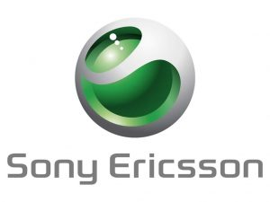

[**Sonny Ericsson رفضت تصنيع الـ Nexus One قبل أن تتجه Google نحو HTC**](https://www.it-scoop.com/2010/02/sonny-ericsson-%d8%b1%d9%81%d8%b6%d8%aa-%d8%aa%d8%b5%d9%86%d9%8a%d8%b9-%d8%a7%d9%84%d9%80-nexus-one-%d9%82%d8%a8%d9%84-%d8%a3%d9%86-%d8%aa%d8%aa%d8%ac%d9%87-google-%d9%86%d8%ad%d9%88-htc/)

حسب التصريح الذي أدلى به Bert Nordberg الرئيس التنفيذي لـ Sony Ericsson لجريدة [Sydsvenskan](http://sydsvenskan.se/ekonomi/article630895/Sony-Ericsson-nobbade-Googles-mobilsatsning.html) السويدية، فإنه هو وراء رفض شركته تصنيع جهاز Nexus One لصالح Google.

حسب Bert Nordberg فإن الأجهزة المصنعة من طرف Sony Ericsson  يجب أن تباع تحت اسم Sony Ericsson و ليس تحت علامة تجارية أخرى، و هو الحال مع جهاز Nexus One المصنع من طرف HTC و الذي يباع تحت اسم Google.

الغريب في الأمر هو أن هذا الرفض جاء في خضم الأزمة المالية التي تعاني منها الشركة، و هو الأمر الذي إما ينم عن دهاء كبير، أو ربما  قرار تم اتخاذه بصورة سيئة.

الزمن وحده كفيل بإثبات ذلك.

و أنت ، كيف تقرأ رفض شركة Sony Ericsson  لمثل هذه الفرصة، و التي قد تكون فرصة القرن لمصنعي الهواتف؟
