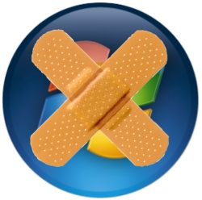

[**Microsoft تنشر محتوى الـ Patch Tuesday لشهر مارس و الذي لا يحتوي على ترقيع لثغرة الـ F1 على Internet Exploter**](https://www.it-scoop.com/2010/03/microsoft-%d8%aa%d9%86%d8%b4%d8%b1-%d9%85%d8%ad%d8%aa%d9%88%d9%89-%d8%a7%d9%84%d9%80-patch-tuesday-%d9%84%d8%b4%d9%87%d8%b1-%d9%85%d8%a7%d8%b1%d8%b3-%d9%88-%d8%a7%d9%84%d8%b0%d9%8a-%d9%84%d8%a7-%d9%8a/)

قامت Microsoft بنشر محتوى الـ Patch Tuesday لشهر مارس  و الذي يحتوي 8 ترقيعات تخص الـ Windows و الـ Office معا.

الـ Patch Tuesday لهذا الشهر  تخص ثغرات وصفت بالهامة في كل من أنظمة Windows XP SP2 و SP3، Windows Vista SP1  و SP2 و نظام Windows7. إضافة إلى برنامج الـ Office  في إصداراته  XP، 2003 ، 2007 لأنظمة Windows و Office Mac 2004  و 2008 و محول ملفات XML الخاص بالحزمة.

لن يحتوي الـ Patch Tuesday لهذا الشهر  أي ترقيعات [لثغرة الـ F1 التي تم اكتشافها بحر هذا الأسبوع](../../../../../2010/03/%d8%ab%d8%ba%d8%b1%d8%a9-%d8%ac%d8%af%d9%8a%d8%af%d8%a9-%d9%81%d9%8a-%d8%a7%d9%84%d9%80-internet-explorer-%d8%aa%d8%ac%d8%b9%d9%84-%d8%a7%d8%b3%d8%aa%d8%b9%d9%85%d8%a7%d9%84-%d9%85%d9%81%d8%aa%d8%a7/)، و التي قد تأخذ شهورا إضافية إلى حين إصدار Microsoft تصحيحا لها.

يمكن الإطلاع على تفاصيل الـ Patch Tuesday لشهر مارس من [هنا](http://www.microsoft.com/technet/security/bulletin/ms10-mar.mspx/)
