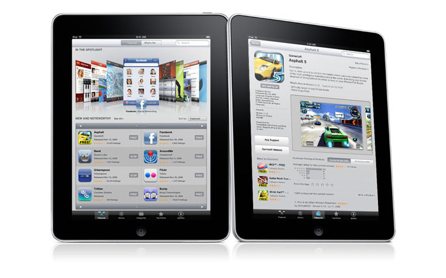

[**Apple تعلن عن الثالث من أبريل القادم كبداية لتسويق جهاز الـ iPad**](https://www.it-scoop.com/2010/03/apple-%d8%aa%d8%b9%d9%84%d9%86-%d8%b9%d9%86-%d8%a7%d9%84%d8%ab%d8%a7%d9%84%d8%ab-%d9%85%d9%86-%d8%a3%d8%a8%d8%b1%d9%8a%d9%84-%d8%a7%d9%84%d9%82%d8%a7%d8%af%d9%85-%d9%83%d8%a8%d8%af%d8%a7%d9%8a%d8%a9/)

أعلنت Apple عن أن الثالث من أبريل القادم سيكون أول أيام تسويق الجهاز اللوحي المنتظر iPad في الولايات المتحدة.

الجهاز اللوحي iPad و الذي يعمل على نظام iPhone OS سيكون متوفرا للحجز بداية من الثاني عشر من الشهر الجاري، لكن النسخة الوحيدة التي ستسوق في هذا التاريخ هي ذات اتصال Wi-Fi فقط.

أما فيما يخص اتصال 3G فالأمر سيتأخر إلى غاية نهاية شهر أبريل، و هو نفس الأمر فيما يخص إطلاق جميع إصدارات الجهاز في كل من كندا ، فرنسا، ألمانيا، إيطاليا، اليابان، إسبانيا، سويسرا و المملكة المتحدة.

سيكون سعر  الجهاز ذي اتصال Wi-FI و قرص 16 Gb 499$.

يمكن الإطلاع على الإعلان الرسمي لإطلاق الجهاز من [هنا](http://www.apple.com/pr/library/2010/03/05ipad.html)
