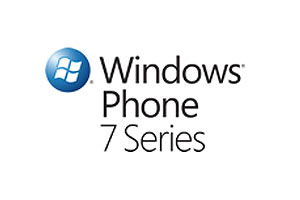

[**Windows Phone 7 series لن يدعم تشغيل برامج Windows Mobile**](https://www.it-scoop.com/2010/03/windows-phone-7-series-%d9%84%d9%86-%d9%8a%d8%af%d8%b9%d9%85-%d8%aa%d8%b4%d8%ba%d9%8a%d9%84-%d8%a8%d8%b1%d8%a7%d9%85%d8%ac-windows-mobile/)

صرحت شركة Microsoft بأنّ نظام تشغيل Windows Phone 7 series  الخاص بالهواتف الذكية لن يدعم تشغيل أية برامج قديمة تمت كتابتها للأنظمة السابقة, كما أنها لن تدعم عملية التحديث من النسخ السابقة إلى هذا النظام.

** **

حيث صرح Charlie Kindel المسؤول في شركة Microsoft عن العلاقة مع المطورين  في [مدونته](http://blogs.msdn.com/ckindel/archive/2010/03/04/different-means-better-with-the-new-windows-phone-developer-experience.aspx) أنّ التخلص من التطبيقات القديمة كان ضروريا لجعل النظام الجديد قوي و سهل الاستخدام.

هذا الإعلان من شركة Microsoft جاء مخيبا لآمال الكثير من الشركات التي قامت بعمل العديد من البرامج على الـ Windows Mobile و التي سينتهي بها المطاف في سلة المهملات أو عليهم إعادة كتابتها من جديد.

من جهة أخرى من شأن هذا الإعلان أن يضع المطورين لنظام Windows Mobile في معضلة كبيرة فهم لا يستطيعون الاستمرار في كتابة برامجهم لنظام Windows Mobile و الذي سوف يموت قريبا، هذا من ناحية و من ناحية أخرى لا يستطيعون كتابة تطبيقات لي Windows Phone 7 الذي لم يصدر بعد.

الغريب في الأمر أنّ جميع الشركات الصانعة للهواتف تحرص على زيادة عدد تطبيقاتها مثل شركة Apple التي وصل عدد التطبيقات الخاصة بها في  الـ App Store إلى ما يزيد عن 100,000 تطبيق, وشركة Nokia  أيضا التي لديها الكثير و الكثير من التطبيقات, بينما تقوم شركة Microsoft بنسف عشرات الآلاف من التطبيقات التي تم تطويرها.

-   هل تظن أنها سوف تكون النهاية لمايكرسوفت في مجال أنظمة تشغيل الهواتف, أم أنها سوف تنهض بقوة من جديد كما فعلت عندما قدمت Windows 7؟
