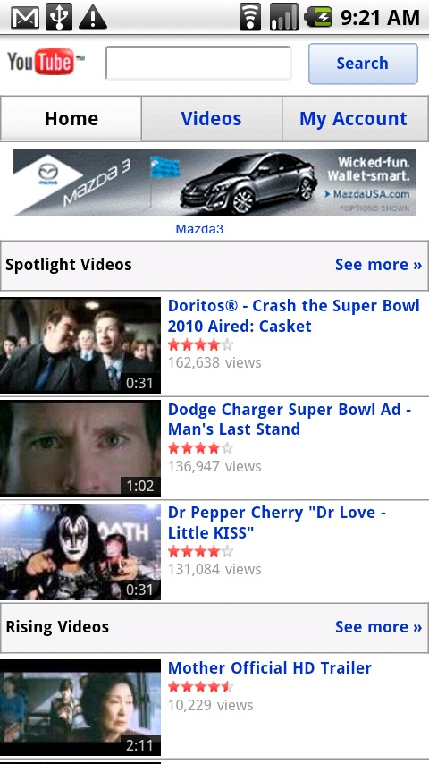

[**Google تطلق خدمة الإعلانات على نسخة Youtube الخاصة بالهواتف**](https://www.it-scoop.com/2010/03/google-%d8%aa%d8%b7%d9%84%d9%82-%d8%ae%d8%af%d9%85%d8%a9-%d8%a7%d9%84%d8%a5%d8%b9%d9%84%d8%a7%d9%86%d8%a7%d8%aa-%d8%b9%d9%84%d9%89-%d9%86%d8%b3%d8%ae%d8%a9-youtube-%d8%a7%d9%84%d8%ae%d8%a7%d8%b5%d8%a9/)

أعلنت Google على مدونتها الرسمية إطلاقها لخدمة الإعلانات على نسخة Youtube الخاصة بالهواتف، و هذا في كل من الولايات المتحدة و اليابان.

حسب Google، فإن حجم الزيارات إلى Youtube من خلال الهواتف شهد زيادة قدرت بـ 160% خلال العام الماضي، و كل يوم يتم استعراض عشرات الملايين من الفيديوهات من خلالها.

كما تشير إلى أنه تم  التعاقد مع بعض الشركات للإعلان لديها على خدمتها الجديدة و تذكر كلا من Sony و Kia.

بالرغم من الانتشار الكبير للهواتف في مختلف أنحاء العالم إلا أن العديد من الدراسات تشير إلى عزوف الشركات عن الإعلان  عليها، و هو الجدار الذي ستواجهه Google، و وحده الزمن كفيل بإخبارنا إن كانت الخدمة الجديدة لـ Google ستلاقي رواجا أو لا.

يمكن الإطلاع على الإعلان عن الخدمة الجديدة من [هنا](http://googleblog.blogspot.com/2010/03/youtube-calling-now-serving-ads-on.html?utm_source=feedburner&utm_medium=feed&utm_campaign=Feed%3A+blogspot%2FMKuf+%28Official+Google+Blog%29&utm_content=Google+Reader)
