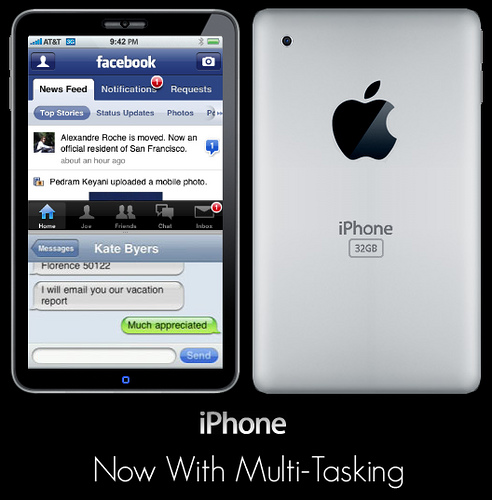

[**نظام iPhone OS 4.0 سيدعم الـ multitasking**](https://www.it-scoop.com/2010/03/%d9%86%d8%b8%d8%a7%d9%85-iphone-os-4-0-%d8%b3%d9%8a%d8%af%d8%b9%d9%85-%d8%a7%d9%84%d9%80-multitasking/)

إذا صدق ما ذهب إليه موقع [appleinsider](http://www.appleinsider.com/articles/10/03/11/apples_iphone_4_0_software_to_deliver_multitasking_support.html) فإن النظام القادم من نظام تشغيل iPhone OS 4.0 سيدعم الـ multitasking.

الـ multitasking سيسمح لمستخدمي أجهزة الـ iPhone و الـ iPad باستعمال أكثر من تطبيق في آن واحد، عكس ما هو الأمر عليه حاليا مع الإصدارات الحالية لنظام iPhone OS.

في حقيقة الأمر نظام الـ iPhone يدعم الـ multitasking  لكن فضلت Apple تعطيل هذه الخاصية، و سمحت بها فقط للوظائف الأساسية على النظام، على غرار استقبال المكالمات و الرسائل و ما إلى ذلك.

و إن صدق فعلا هذا الخبر، فهذا يعني أن Apple قد توصلت أخيرا لحل المعضلة الأساسية التي كانت ستحدث لو سمحت بالـ multitasking في الإصدارات الحالية و هو استهلاك الطاقة، إذ أنه من المعلوم أن الـ multitasking يعني استعمال المعالج بصفة أكبر و هو ما يحتاج إلى طاقة أكبر.

من المتوقع صدور الإصدار الرابع من نظام iPhone OS خلال الصيف القادم.
