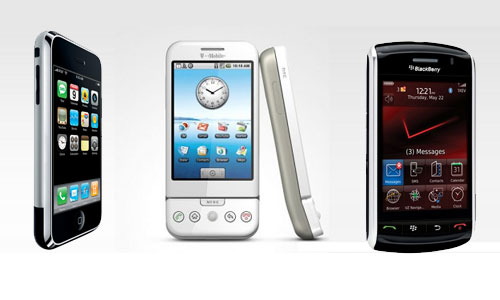

[**Android يتقدم بخطى ثابتة في الولايات المتحدة، و Windows Mobile يتراجع**](https://www.it-scoop.com/2010/03/android-%d9%8a%d8%aa%d9%82%d8%af%d9%85-%d8%a8%d8%ae%d8%b7%d9%89-%d8%ab%d8%a7%d8%a8%d8%aa%d8%a9-%d9%81%d9%8a-%d8%a7%d9%84%d9%88%d9%84%d8%a7%d9%8a%d8%a7%d8%aa-%d8%a7%d9%84%d9%85%d8%aa%d8%ad%d8%af%d8%a9/)

إذا صدقت آخر إحصائيات ComScore  فإن نظام تشغيل Android المقدم من طرف Google يتقدم بخطى ثابتة نحو نسبة 10% من إجمالي سوق أنظمة تشغيل الهواتف الذكية في الولايات المتحدة.

حسب هذه الإحصائيات فإن الصدارة لا تزال خالصة لشركة RIM بفضل أجهزة الـ Blackberry بنسبة 43% يليها نظام iPhone OS بنسبة 25,1%.

أما  Android فقد حظي بنسبة 7.1% و هو ما يمثل زيادة معتبرة خاصة إذا علمنا أن حصته من السوق لم تتجاوز 4,3% في شهر أكتوبر الماضي، و هو ما يجعله يتجاوز نظام WebOS المستعمل على أجهزة Palm و الذي قدرت حصته بـ 5,7%.

أما فيما يخص نظام Windows Mobile فقد شهد ترجعا يقدر بـ 4% حيث تراجعت حصته إلى 15,7% فقط، و هو الأمر الذي لن يطول على هذا الحال، إن عرفت Microsoft كيف تروج و تنشر نظامها القادم Windows Phone 7 series.

يمكن الإطلاع على الإحصائيات كاملة من [هنا](http://www.comscore.com/Press_Events/Press_Releases/2010/3/comScore_Reports_January_2010_U.S._Mobile_Subscriber_Market_Share)

-   هل تظنون أن بإمكان نظام Windows Phone 7 Series استعادة المجد الذي ضاع من الـ Windows Mobile؟

-   كيف تفسر عدم تمكن الـ iPhone من انتزاع الصدارة من الـ Blackberry؟
