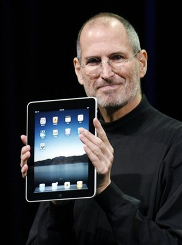

[**Apple تبيع 120,000 جهاز iPad خلال يوم واحد**](https://www.it-scoop.com/2010/03/apple-%d8%aa%d8%a8%d9%8a%d8%b9-120000-%d8%ac%d9%87%d8%a7%d8%b2-ipad-%d8%ae%d9%84%d8%a7%d9%84-%d9%8a%d9%88%d9%85-%d9%88%d8%a7%d8%ad%d8%af/)

51 ألف خلال أول ساعتين ، 120 ألف خلال اليوم الأول، ليس هذا عدد حبات الحلوى التي باعها بقال الحي الذي أسكن فيه و إنما هو عدد أجهزة الـ iPad التي استطاعت Apple بيعها في اليوم الأول من الحجز المسبق لطلبات شراء الجهاز اللوحي الذي أسال الكثير من الحبر.

هذه الإحصائيات لم ترسم بعد إذ لم تقدم Apple أية أرقام عن عملية الحجز المبكر هذه، و لكنها مقدمة من طرف InvestorVillage موقع التحليلات الاقتصادية، لكن العجيب في الأمر هو هذا العدد الكبير من عمليات الشراء من طرف أشخاص لم ترى أغلبيتها و لم تلمس جهاز iPad من قبل.

عملية الحجوزات هذه سمحت لـ Apple الحصول على 75 مليون دولار في يوم واحد.

على صعيد آخر، فلقد وضحت Apple خدماتها لما بعد البيع الخاصة بالـ iPad، إذ أنه في حالة الرغبة في [تغيير البطارية](http://www.apple.com/support/ipad/service/battery/)، فإن كل الجهاز الذي سيغير مقابل 99 دولار ، مما يعني وجوب نقل البيانات الموجودة على الجهاز قبل القيام بذلك.

يمكن الإطلاع على مزيد من التفاصيل بزيارة موقع Fortune من [هنا](http://brainstormtech.blogs.fortune.cnn.com/2010/03/13/day-1-estimate-120000-ipads-sold/)
