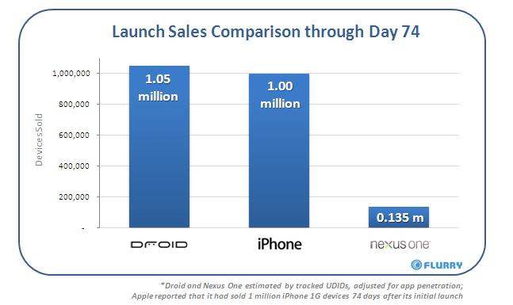

[**Google لم تتمكن من بيع سوى 135 ألف قطعة من Nexus One خلال 74 يوم**](https://www.it-scoop.com/2010/03/google-%d9%84%d9%85-%d8%aa%d8%aa%d9%85%d9%83%d9%86-%d9%85%d9%86-%d8%a8%d9%8a%d8%b9-%d8%b3%d9%88%d9%89-135-%d8%a3%d9%84%d9%81-%d9%82%d8%b7%d8%b9%d8%a9-%d9%85%d9%86-nexus-one-%d8%ae%d9%84%d8%a7%d9%84-74/)

إذا صدقت إحصائيات Flurry فإن Google لا تزال تعاني و لا تجد الحلول لتسويق Nexus One حيث لم تتمكن من بيع سوى 135 ألف قطعة خلال 74 يوم.

حسب هذه الإحصائيات فإنه في نفس المدة  تمكنت Apple من بيع مليون قطعة من الـ iPhone لدى إطلاقه خلال العام 2007، أما Motorola فقد باعت 1.05 مليون قطعة من جهاز Droid المجهز بنظام Android.

يرجع أغلب المحللين أسباب هذا العدد القليل إلى السياسة التي انتهجتها Google لبيع جهازها، و لخدمات ما بعد البيع، حيث لا يتوفر كلاهما سوى عبر الإنترنت.

للتذكير فإن Google  لم تبع سوى 20 ألف قطعة خلال الأسبوع الأول من إطلاقه، مقابل 1,6 مليون قطعة تمكنت Apple من بيعها خلال الأسبوع الأول من إطلاق iPhones GS3.

يمكن الإطلاع على كامل الإحصائيات من [هنا](http://blog.flurry.com/bid/31410/Day-74-Sales-Apple-iPhone-vs-Google-Nexus-One-vs-Motorola-Droid)

-   هل تظن أن Google قد أخفقت فعلا في جهاز Nexus One رغم المزايا التقنية التي يتمتع بها؟

أقرأ أيضا:

[**Apple ****تبيع 120,000 جهاز**** iPad ****خلال يوم واحد**](../../../../../2010/03/apple-%d8%aa%d8%a8%d9%8a%d8%b9-120000-%d8%ac%d9%87%d8%a7%d8%b2-ipad-%d8%ae%d9%84%d8%a7%d9%84-%d9%8a%d9%88%d9%85-%d9%88%d8%a7%d8%ad%d8%af/)
