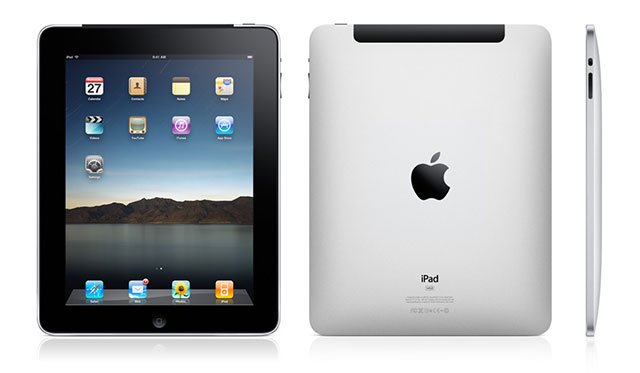
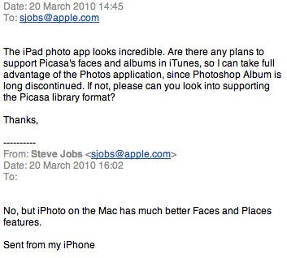

[**Steve Jobs يعلن أن الـ iPad لن يدعم خدمة Picassa  المقدمة من طرف Google**](https://www.it-scoop.com/2010/03/steve-jobs-%d9%8a%d8%b9%d9%84%d9%86-%d8%a3%d9%86-%d8%a7%d9%84%d9%80-ipad-%d9%84%d9%86-%d9%8a%d8%af%d8%b9%d9%85-%d8%ae%d8%af%d9%85%d8%a9-picassa-%d8%a7%d9%84%d9%85%d9%82%d8%af%d9%85%d8%a9-%d9%85%d9%86/)

في رده  عن سؤال يخص أحدث إنتاجات Apple و المتمثلة في  الجهاز اللوحي، قال Steve jobs أن iPad لن يدعم خدمة مشاركة الصور و معرفة الوجوه التي يقدمها برنامج Google الشهير Picassa و الذي يعتبر من أكثر البرامج تقدما في معرفة الوجوه.

وقال Steve jobs أن iPad بكل وضوح:"لا، iPad مكتف بـ iPhoto الذي يقوم بخدمة جبدة لحد الآن" في رد على أحد الرسائل التي وصلته على بريده الالكتروني(sjobs@apple.com). وفيما يلي نص الرسالة:

يذكر أن شركة Apple  [باعت ما يزيد عن  120,000 جهاز iPad خلال يوم واحد](https://www.it-scoop.com/2010/03/apple-%d8%aa%d8%a8%d9%8a%d8%b9-120000-%d8%ac%d9%87%d8%a7%d8%b2-ipad-%d8%ae%d9%84%d8%a7%d9%84-%d9%8a%d9%88%d9%85-%d9%88%d8%a7%d8%ad%d8%af/) وهذا يظهر حجم الطلب المتزايد في الولات المتحدة على الجهاز اللوحي الجديد.

[المصدر](http://mashable.com/2010/03/21/ipad-picasa/?utm_source=feedburner&utm_medium=feed&utm_campaign=Feed%3A+Mashable+%28Mashable%29)
- هل تطن أن دعم iPad لـ  Picassa كان سيشكل من جهة دفعة قوية لـ  Google و تهديدا لـ Apple من جهة أخرى؟
