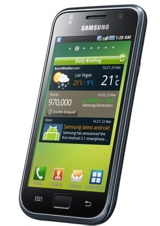

[**Samsung تكشف النقاب عن الهاتف Galaxy S المزود بـ Android**](https://www.it-scoop.com/2010/03/samsung-%d8%aa%d9%83%d8%b4%d9%81-%d8%a7%d9%84%d9%86%d9%82%d8%a7%d8%a8-%d8%b9%d9%86-%d8%a7%d9%84%d9%87%d8%a7%d8%aa%d9%81-galaxy-s-%d8%a7%d9%84%d9%85%d8%b2%d9%88%d8%af-%d8%a8%d9%80-android/)

أعلن JK Shin المدير العام لشركة Samsung في كلمته الافتتاحية خلال المؤتمر العالمي CTIA WIRELESS 2010  المقام في Las Vegas  ولاية Nevada الأميركية عن إطلاق الهاتف Galaxy S المدعم بالـ Android.

الهاتف الجديد و الذي يعد آخر تقنية الهواتف لدي Samsung يتميز بشاشة 4 بوصات و معالج 1GH يسمح للمستخدم باستغلال أحسن للـ Multimedia الحالية والتي تتطلب شاشة عالية الدقة و معالج بسرعة عالية.

كما تم تزويد الهاتف بمزايا عديدة منها تطبيقات تسمح للمستخدم بقراءة ملفات Microsoft Office 2007 وكذا خاصية Daily briefing و التي تزود المستخدم بما هو جديد يوميا.
[المصدر.](http://vr-zone.com/articles/samsung-announces-android-powered-galaxy-s/8661.html)
