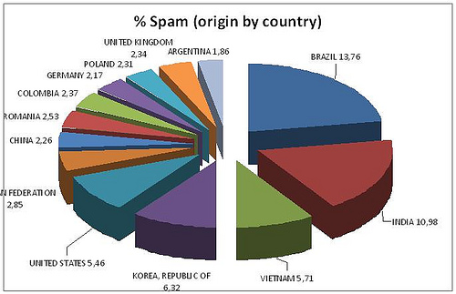

[**البرازيل و الهند و كوريا الجنوبية تتصدر قائمة البلدان المرسلة للـ Spam، حسب دراسة لـ Panda**](https://www.it-scoop.com/2010/03/%d8%a7%d9%84%d8%a8%d8%b1%d8%a7%d8%b2%d9%8a%d9%84-%d9%88-%d8%a7%d9%84%d9%87%d9%86%d8%af-%d9%88-%d9%83%d9%88%d8%b1%d9%8a%d8%a7-%d8%a7%d9%84%d8%ac%d9%86%d9%88%d8%a8%d9%8a%d8%a9-%d8%aa%d8%aa%d8%b5%d8%af/)

أظهرت دراسة قامت بها Panda Software خلال الشهرين الماضيين أن كل  من البرازيل و الهند و كوريا الجنوبية حازت على نسبة 30% من إجمالي الـ Spam المرسل عالميا.

تصدرت البرازيل  القائمة  بنسبة 13,76 % و تلتها الهند بنسبة 10,98 % و تبعتها كوريا الجنوبية بنسبة 6,32 % ، و لم تحز روسيا أو الصين إلا عن 2,85% بالنسبة للأولى و 2,26% للثانية، و هما الدولتان اللتان عادة ما يشار لهما بالبنان لدى الحديث عن الـ Spam.

اللافت للانتباه أن الملايين الخمسة من الرسائل التي كانت محور هذه الدراسة تم إرسالها من ما يقارب المليون عنوان IP مختلف مما يعني أن شبكات الـ Botnet ما زالت مسؤولة عن قسط كبير منها بالرغم من المحاولات المتكررة للقضاء عليها.

<!-- more -->
<table cellpadding="0" cellspacing="0" border="1" >
<tbody >
<tr style="text-align: center;" >

<td width="144" valign="top" >**الدولة**
</td>

<td width="74" valign="top" >**% Spam******
</td>

<td width="76" valign="top" >**% IPs******
</td>
</tr>
<tr >

<td width="144" valign="top" >**البرازيل******
</td>

<td width="74" valign="top" >13.76
</td>

<td width="76" valign="top" >8.60
</td>
</tr>
<tr >

<td width="144" valign="top" >**الهند******
</td>

<td width="74" valign="top" >10.98
</td>

<td width="76" valign="top" >8.60
</td>
</tr>
<tr >

<td width="144" valign="top" >**كوريا   الجنوبية******
</td>

<td width="74" valign="top" >6.32
</td>

<td width="76" valign="top" >4.00
</td>
</tr>
<tr >

<td width="144" valign="top" >**فيتنام******
</td>

<td width="74" valign="top" >5.71
</td>

<td width="76" valign="top" >6.01
</td>
</tr>
<tr >

<td width="144" valign="top" >**الولايات   المتحدة******
</td>

<td width="74" valign="top" >5.46
</td>

<td width="76" valign="top" >7.17
</td>
</tr>
<tr >

<td width="144" valign="top" >**روسيا******
</td>

<td width="74" valign="top" >2.85
</td>

<td width="76" valign="top" >2.90
</td>
</tr>
<tr >

<td width="144" valign="top" >**رومانيا******
</td>

<td width="74" valign="top" >2.53
</td>

<td width="76" valign="top" >3.42
</td>
</tr>
<tr >

<td width="144" valign="top" >**كولومبيا******
</td>

<td width="74" valign="top" >2.37
</td>

<td width="76" valign="top" >1.82
</td>
</tr>
<tr >

<td width="144" valign="top" >**المملكة   المتحدة******
</td>

<td width="74" valign="top" >2.34
</td>

<td width="76" valign="top" >3.06
</td>
</tr>
<tr >

<td width="144" valign="top" >**بولونيا******
</td>

<td width="74" valign="top" >2.31
</td>

<td width="76" valign="top" >3.05
</td>
</tr>
<tr >

<td width="144" valign="top" >**الصين******
</td>

<td width="74" valign="top" >2.26
</td>

<td width="76" valign="top" >2.20
</td>
</tr>
<tr >

<td width="144" valign="top" >**ألمانيا******
</td>

<td width="74" valign="top" >2.17
</td>

<td width="76" valign="top" >4.48
</td>
</tr>
<tr >

<td width="144" valign="top" >**الأرجنتين******
</td>

<td width="74" valign="top" >1.86
</td>

<td width="76" valign="top" >1.72
</td>
</tr>
</tbody>
</table>
يمكن الإطلاع على كافة تفاصيل الدراسة من [هنا](http://www.pandasecurity.com/homeusers/media/press-releases/viewnews?noticia=10111)
