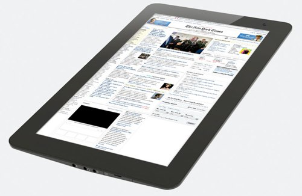

[**Fusion Garage تشرع في تسويق Joojoo الجهاز اللوحي المنافس للـ iPad و الذي يقرأ الـ Flash بدقة وضوح عالية**](https://www.it-scoop.com/2010/03/fusion-garage-%d8%aa%d8%b4%d8%b1%d8%b9-%d9%81%d9%8a-%d8%aa%d8%b3%d9%88%d9%8a%d9%82-joojoo-%d8%a7%d9%84%d8%ac%d9%87%d8%a7%d8%b2-%d8%a7%d9%84%d9%84%d9%88%d8%ad%d9%8a-%d8%a7%d9%84%d9%85%d9%86%d8%a7%d9%81/)

أياما قليلة فقط قبل انطلاق تسويق iPad  جهاز Apple اللوحي و المنتظر أن يكون ابتداءً من الثالث من أبريل القادم، تطلق Fusion Garage حملة تسويق جهازها Joojoo و الذي سيُشرع في تسويقه ابتداءً من الـ 29 من الشهر الجاري.

سيسوق الجهاز الجديد بنفس سعر الـ iPad أي بـ 499$ للقطعة الواحدة، و الذي يحتوي على شاشة 12 بوصة و المجهز بالـ Chipset lon المقدمة من طرف NVIDIA  إضافة إلى معالج Atom N270 ذي تردد 1,6 Ghz، كما أن جهاز Joojoo قادر على قراءة الـ Flash بدقة وضوح عالية HD

أما فيما يخص البطارية فيمكنها أن تصمد ما بين 5 إلى 10 ساعات.

يمكن الإطلاع على تفاصيل أكثر حول جهاز Joojoo من على موقعه الرسمي من [هنا](https://thejoojoo.com/)

- هل تعتقد أنه من الممكن أن يشكل Joojoo تهديدا حقيقيا لجهاز iPad الخاص بـ Apple
