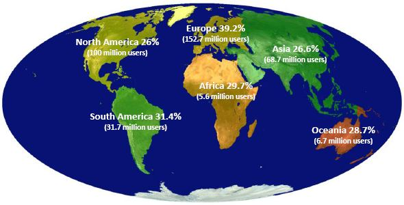
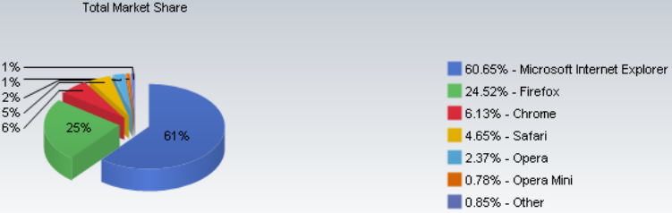

[**Mozilla تشير إلى أنها تستحوذ على 40% من سوق المتصفحات في أوروبا، و Chrome يواصل صعوده بقوة**](https://www.it-scoop.com/2010/04/mozilla-%d8%aa%d8%b4%d9%8a%d8%b1-%d8%a5%d9%84%d9%89-%d8%a3%d9%86%d9%87%d8%a7-%d8%aa%d8%b3%d8%aa%d8%ad%d9%88%d8%b0-%d8%b9%d9%84%d9%89-40-%d9%85%d9%86-%d8%b3%d9%88%d9%82-%d8%a7%d9%84%d9%85%d8%aa%d8%b5/https://www.it-scoop.com/2010/04/mozilla-%d8%aa%d8%b4%d9%8a%d8%b1-%d8%a5%d9%84%d9%89-%d8%a3%d9%86%d9%87%d8%a7-%d8%aa%d8%b3%d8%aa%d8%ad%d9%88%d8%b0-%d8%b9%d9%84%d9%89-40-%d9%85%d9%86-%d8%b3%d9%88%d9%82-%d8%a7%d9%84%d9%85%d8%aa%d8%b5/)

نشرت  Mozilla وثيقة سمتها «The State of the Internet» و الذي تشير فيها إلى أن  متصفحها Firefox يستحوذ على 40% من سوق المتصفحات في أوروبا خلال الربع الأول من العام الجاري.

حسب هذه الوثيقة، فإن عدد مستخدمي  Firefox حول العالم وصل إلى 350 مليون مستخدم، أي ما يمثل 30% من سوق المتصفحات العالمي.

في نفس السياق، فقد أشارت آخر الإحصائيات الصادرة عن NetApplications و التي تخص المتصفحات خلال شهر مارس الماضي إلى أن حصة Firefox من السوق العالمية هو 24,52% ،  بينما يواصله Chrome زحفه حيث قفز من 5.6% خلال شهر فبراير الماضي ليصل إلى 6.13% خلال شهر مارس مما يمثل ربع حصة Firefox في سوق المتصفحات، و هو الإنجاز الذي سيأخذه الجميع بالحسبان، بحكم أن حصة Chrome لم تكن تتجاوز 1.62%  في نفس الفترة من العام الماضي.

يمكن الإطلاع و تحميل وثيقة  The State of the Internet من [هنا](http://blog.mozilla.com/metrics/2010/03/31/mozillas-q1-2010-analyst-report-state-of-the-internet/)

كما يمكن مشاهدة كامل تفاصيل دراسة NetApplications من [هنا](http://www.netmarketshare.com/report.aspx?qprid=0&qpcal=1&qptimeframe=M&qpsp=134)

-   إلى أي مدى تتوقع أن يصل متصفح Chrome إليه، خاصة بعد الحملة الإعلانية الكبيرة التي قامت بها Google خلال الشهر الماضي؟
