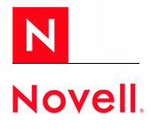

[**محكمة أمريكية تؤكد ملكية Novell لحقوق الملكية الفكرية الخاصة بـ UNIX**](https://www.it-scoop.com/2010/04/%d9%85%d8%ad%d9%83%d9%85%d8%a9-%d8%a3%d9%85%d8%b1%d9%8a%d9%83%d9%8a%d8%a9-%d8%aa%d8%a3%d9%83%d8%af-%d9%85%d9%84%d9%83%d9%8a%d8%a9-novell-%d9%84%d8%ad%d9%82%d9%88%d9%82-%d8%a7%d9%84%d9%85%d9%84%d9%83/)

حكم القضاء الأمريكي لصالح Novell في قضية رفعتها ضدها SCO Group و  المتعلقة بحقوق الملكية الفكرية  copyright ** **لـ Unix.

وقائع القضية تعود إلى سنة 1995، حيث اشترت مجموعة Santa Cruz Operation نظام UNIX من Novell مقابل 149 مليون دولار، مما دفع بهذه المجموعة بمطالبة  أكثر من 1500 شركة سنة 2007 بدفع حقوق استغلال نظام Linux بحكم أن هذا الأخير يعتمد كثيرا على نظام Unix.

لكن منذ سنتين، أعلنت مجموعة SCO إفلاسها بعد أن رفض قاض أمريكي امتلاكها لحقوق الملكية الفكرية لـ UNIX.

أبدت Novell ارتياحها لهذا الحكم، حيث صرحت على لسان مديرها العام  Ron Hovsepian، حيث صرح أن هذا القرار يخدم كلا من Novell ،Linux و مجتمع المصادر المفتوحة

يمكن قراءة إعلان Novell عن هذا القرار من [هنا](http://www.novell.com/news/press/utah-jury-confirms-novell-has-ownership-of-unix-copyrights/)
