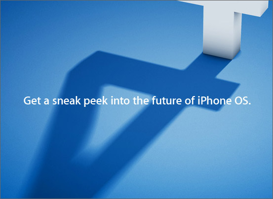

[**Apple تحضر للإعلان على الجيل الرابع من نظام iPhone OS الخميس القادم**](https://www.it-scoop.com/2010/04/apple-%d8%aa%d8%ad%d8%b6%d8%b1-%d9%84%d9%84%d8%a5%d8%b9%d9%84%d8%a7%d9%86-%d8%b9%d9%84%d9%89-%d8%a7%d9%84%d8%ac%d9%8a%d9%84-%d8%a7%d9%84%d8%b1%d8%a7%d8%a8%d8%b9-%d9%85%d9%86-%d9%86%d8%b8%d8%a7%d9%85-i/)

أرسلت شركة Apple إلى مجموعة من وسائل الإعلام دعوات لحضور حدث خاص يوم الخميس القادم، و الذي ستكشف فيه شركة التفاحة المقضومة الستار  على الجيل الرابع من نظام تشغيل iPhone OS و هذا أياما قليلة فقط بعد أن شغلت الدنيا بإطلاقها لجهازها اللوحي iPad.

سيتم الخميس القادم تأكيد أو نفي تفعيل خاصية الـ Multitasking  و التي ستسمح لو تم تفعيلها للمستخدمين باستعمال أكثر من تطبيق في آن واحد، و هي الخاصية التي ينتظرها الجميع.

لا نعرف بعد إن كان الإصدار الرابع من نظام تشغيل iPhone سيشمل خواصا جديدة تخص الـ iPad، أو دعم الكاميرات الأمامية التي يطالب بها العديدون من مستخدمي الـ iPhone، حيث أن الدعوة المرسلة لوسائل الإعلام لم تذكر سوى تاريخ و وقت الحدث.

[المصدر](http://www.pcworld.com/article/193460/apple_to_preview_new_iphone_os_this_week.html)

- ما هي الإضافات و التحسينات التي تتوقعها في الإصدار القادم من نظام iPhone OS؟
