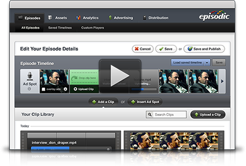

[**Google تستحوذ على شركة Episodic، و توحي بقرب إطلاق المحتوى مدفوع الأجر على Youtube**](https://www.it-scoop.com/2010/04/google-%d8%aa%d8%b3%d8%aa%d8%ad%d9%88%d8%b0-%d8%b9%d9%84%d9%89-%d8%b4%d8%b1%d9%83%d8%a9-episodic%d8%8c-%d9%88-%d8%aa%d9%88%d8%ad%d9%8a-%d8%a8%d9%82%d8%b1%d8%a8-%d8%a5%d8%b7%d9%84%d8%a7%d9%82-%d8%a7/)

استحوذت Google على الشركة الناشئة Episodic المتخصصة في خدمات الفيديو على الإنترنت مقابل صفقة لم يتم الإفصاح عنها، بعدما أن كانت جميع الأنظار متجهة قِبَل شركة Brightcove المنافسة لها و التي تفوقها شهرة.

شراء شركة Episodic يفسره الكثير من المحللين برغبة Google المضي قدما في تحسين موقع Youtube و إضافة خدمات إضافية إليه متوفرة ضمن خدمات Episodic، حيث أن هذه الأخيرة تملك منصة لتشارك الفيديوهات على الإنترنت تتوفر على العديد من الخواص على غرار إدارة الـ streaming  المباشر، خدمات الـ Video On Demande أو ما يعرف اختصارا بـ VoD يمتاز بإمكانية جعل الفيديوهات مدفوعة الأجر إضافة إلى امتلاك Episodic أدوات لقياس الـ audience في الزمن الحقيقي، و منصة إدارة إعلانات، دون أن ننسى خدمة الـ broadcast الخاصة بالهواتف.

حاليا لا يتم دعم سوى أجهزة الـ iPhone لكن Google تنوي توسيع مجالها إلى كل من أنظمة  Android ، Symbian و الـ BlackBerry.

يمكن الإطلاع على الإعلان الرسمي لعملية الشراء من على مدونة  Episodic الرسمية من [هنا](http://www.episodic.com/episodic-joins-google/).

- ما هي الخدمات و التحسينات التي تتوقعها على خدمات Google عموما و على Youtube خصوصا بعد شراء Episodic ؟
