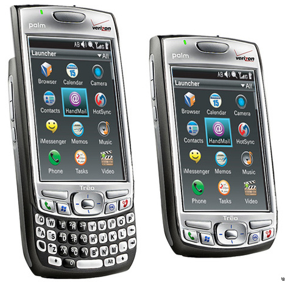

[**إشاعات عن رغبة Lenovo في شراءها، تجعل أسهم  Palm ترتفع بنسبة 20%**](https://www.it-scoop.com/2010/04/%d8%a5%d8%b4%d8%a7%d8%b9%d8%a7%d8%aa-%d8%b9%d9%86-%d8%b1%d8%ba%d8%a8%d8%a9-lenovo-%d9%81%d9%8a-%d8%b4%d8%b1%d8%a7%d8%a1%d9%87%d8%a7%d8%8c-%d8%aa%d8%ac%d8%b9%d9%84-%d8%a3%d8%b3%d9%87%d9%85-palm-%d8%aa/)

بعد كل من Motorolla، Dell، Apple  أو Hp، حان دور Lenovo لتنطلق الإشاعات عن رغبته في شراء شركة Palm و التي سببت ارتفاعا في أسهم هذه الأخيرة بنسبة 20% في بورصة نيويورك يوم أمس.

بالرغم من الحالة الحرجة التي تعاني منها شركة Palm و وضعيتها المعقدة، فإن أغلب المحللين يستبعدون أن تكون هذه الإشاعات صحيحة، حيث سجلت Palm طلبات على أجهزتها الـ Pre و الـ Pixi أقل بكثير مما كانت تتوقع، حيث أن مبيعات قدرت بـ 408 ألف بعد أن سوقت 960 ألف وحدة.

ما ساعد في تأزيم وضعية Palm هو بلا شك الصعود القوي لنظام Android حيث استطاع الحصول على  3,9% خلال سنة واحدة من إطلاقه، دون أن ننسى أجهزة الـ iPhone بإصداراتها المختلفة، و نظام Windows Phone 7 القادم و الذي لن يزيد الطين إلا بلة.

[المصدر](http://localtechwire.com/business/local_tech_wire/news/blogpost/7380778/)
