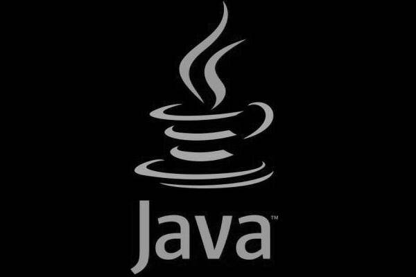

[**ثغرة خطيرة في Java Deployment ToolKit .. وأية ثغرة!**](https://www.it-scoop.com/2010/04/java-deployment-toolkit-vulnerability/)

قام Tavis Ormandy أحد مهندسي Google بنشر تفاصيل ثغرة اكتشفها في حزمة Java Deployment ToolKit على الإنترنت، و التي تسمح للمهاجم بتنفيذ كود ضار (ملف *.jar خبيث) على جهاز المستخدم من خلال المتصفح - أي متصفح! - بطريقة شرعية، مما يعني أن تقنيات الحماية مثل DEP و ASLR لن تستطيع إيقافها!

تزود Java Web Start (المعروفة اختصاراً بـ jws) مطوري جافا بطريقة تسمح لهم بتشغيل وتنصيب برامج عبر المتصفح من نوع *.jnlp

ابتداء من الإصدار Java 6 u10، قامت Java بتوزيع plugin تدعى "Java Deployment Toolkit" توفر للمطورين طريقة أبسط لتوزيع برامجهم على المستخدمين، والتي يتم تثبيتها بصورة افتراضية من قبل JRE (Java Runtime Environment) ومعلّمة على أنها safe لنشر السكربتات.

تقوم وظيفة launch() بأخذ وسيط عبارة عن URL تقوم بتمريره للمقبض المسجّل الخاص بملفات JNLP الذي هو افتراضياً javaws.

المشكلة الموجودة هي أنه لا يتم التحقق بشكل كاف من هذا الوسيط URL، مما يسمح لنا بتمرير وسائط اختيارية إلى javaws، الأمر الذي يؤدي بدوره إلى توفير وسيلة لتمرير وسائط command line يتم من خلالها خلق ثغرة.

يقول Tavis:

<blockquote>البساطة في اكتشاف هذه المشكلة أكّدت لي بأن نشر هذه المعلومات عن الثغرة على العموم هو في صالح الجميع، عدا  الشركة المنتجة.</blockquote>

**الإصدارات المصابة:**

جميع الإصدارات منذ Java 6 update 10 الخاصة بنظام Windows، كما أن تعطيل الـ Plugin غير كاف لمنع المشكلة، حيث إن الحزمة يتم تثبيتها بشكل مستقل.

[`http://java.sun.com/javase/6/docs/technotes/guides/jweb/deployment_advice.html`](http://java.sun.com/javase/6/docs/technotes/guides/jweb/deployment_advice.html)

يعتقد Tavis بأن الإصدارات الخاصة بأنظمة تشغيل أخرى غير Windows غير مصابة بهذه الثغرة (يا سلام :))

**الحماية:**

ينصح Tavis بأن يتم استخدام متصفح Mozilla Firefox مع إضافة NoScript والتي تعطي للمستخدم إمكانية أكبر في التحكم بما يتم تشغيله في المتصفح، إلا أن هذا الإجراء يعتبر مؤقتا ريثما تقوم الشركة بإصدار ترقيع أمني لها.

للإطلاع على تفاصيل أكبر عن المشكلة، يمكنك مراجعة [هذا الرابط](http://www.isecur1ty.org/news/vulnerabilities/245-java-deployment-toolkit-javaws-jnlp.html)

