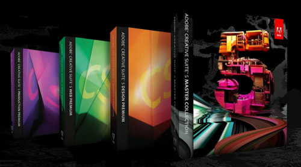

[**Adobe تطلق Creative Suite 5 ، الإصدار الخامس من حزمة برامجها الشهيرة**](https://www.it-scoop.com/2010/04/adobe-launches-adobe-creative-suite-5/)

سيحجز الـ 12 من أبريل من العام الحالي بلا شك مكانا له في التاريخ الرقمي، فبعد [إطلاق Microsoft لأحدث إصدارات Visual Studio و .NET Framework](https://www.it-scoop.com/2010/04/microsoft-launches-visual-studio-2010/)، ها هي Adobe أيضا تطلق حزمتها  CS5 (Creative Suite 5) و التي تأتي بإصدارات جديدة لكل برامج الحزمة، Photoshop ، Premiere، Flash، Illustrator ، After Effects و غيرها.

تأتي هذه الحزمة الجديدة بدعم لمعماريات 64 بت، كما تم الانتقال إلى  إضافة إلى توفرها في 5 إصدارات مختلفة، تتنوع بتنوع الاستعمالات و هي كالتالي:

Design Premium، Design Standard، Web Premium، Production Premium و Master Collection

لا يسعنا هذا ذكر جميع ما تمت إضافته في هذا الإصدار الجديد ، لكن هناك إضافة في برنامج Photoshop تستحق فعلا الذكر و هي خاصية الـ [Content-Aware fill](http://cs5.org/?p=624) و التي تسمح بحذف عناصر على الصور و تعويض المكان الشاغر حسب ما يحيط بذلك العنصر، أو ملء الفراغات البيضاء اعتمادا على نقس التقنية مثلما هو موضح في الصورة التالية:

أما فيما يخص الأسعار، فإنها من ذوات الأربعة أرقام، فمثلا سعر نسخة الـ Design Premium  هو 1899$ و سعر الـ ، Web Premium هو 1799$  و سعر الـ Design Standardهو 1299$، لكن يبقى من الممكن شراء كل تطبيق لوحده.

Creative Suite 5 متوفرة حاليا فقط للحجز، و سيتم تسويق أولى النسخ منها في منتصف الشهر القادم.

يمكن الإطلاع على تفاصيل الحزمة من [هنا](https://store1.adobe.com/cfusion/store/index.cfm?store=OLS-US&storeRegion=US&pid=3668640&nr=0#loc=en_us&view=ols_cat&catID=SPECIALS&store=OLS-US)
