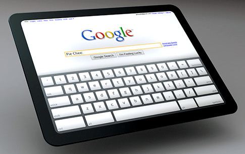

[**Google  أيضا تريد حصتها من سوق الأجهزة اللوحية، و تحضر لجهاز يعمل بنظام  Android**](https://www.it-scoop.com/2010/04/google-preparing-android-tablet/)

نقلت جريدة الـ New York Times اليوم، أن Eric Schmidt المدير التنفيذي لـ Google قد أسر لبعض المقربين له برغبة Google دخول سوق الأجهزة اللوحية، بجهاز يكون مجهزا بنظام Android، و هو الذي هاجم الأجهزة اللوحية سابقا.

حسب بعض المصادر المقربة من الموضوع، فإن Google تتحاور حاليا مع بعض الشركات الإعلامية و دور نشر الكتب، لتوفير محتوى ينشر على الجهاز اللوحي.

الملفت للانتباه في الأمر هو كون النظام الذي ستعتمده Google  هو Android و ليس Chrome OS مما يعطي الانطباع أن الجهاز اللوحي القادم من Google سيكون أقرب إلى "هاتف كبير" مثلما هو الحال مع الـ iPad و ليس إلى جهاز شخصي.

لم ترد بعد أية معلومات عن مواصفات الجهاز و لا عن سعره أو موعد إطلاقه. ترقبوا... فإنا معكم مترقبون :)

يمكن قراءة الخبر الذي أوردته جريدة الـ New York Times من [هنا](http://www.nytimes.com/2010/04/12/technology/12slate.html?pagewanted=2)

-   في رأيك ما السبب الذي يدفع Google إلى اختيار نظام Android  بدل نظام Chrome OS؟

-   و هل عدد التطبيقات الجاهزة لنظام Android قد يكون عاملا مهما في اختيار النظام؟
