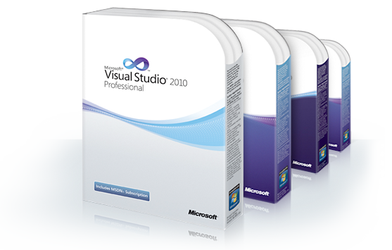

[**Visual Studio 2010 و NET Framework 4 يبصران النور اليوم، و يبشران بالإصدار الرابع من Silverlight**](https://www.it-scoop.com/2010/04/microsoft-launches-visual-studio-2010/)

أطلقت Microsoft اليوم الإصدار 2010  من بيئة التطوير الغنية عن كل تعريف Visual Studio مرفقا بالإصدار الرابع من إطار العمل .NET Framework 4.

الإصدار الحالي من Visual Studio 2010 يعتمد بالأساس على الـ (Windows Presentation Foundation)  WPF ، كما يدعم تقنية الـ multitouch الخاصة بنظام Windows 7 إضافة إلى دعمه لـ Windows Azure لاستفادة من خدمات الـ cloud computing الخاصة بـ Microsoft.

كما رافق هذا الـ IDE إطلاق الإصدار الرابع من إطار العمل .NET Framework  و الذي يركز بالأساس على تطوير المشاريع التي تعتمد على الـ parallelism ، و هو الأمر الذي أملته طبيعة الأجهزة  الحالية و معالجاتها متعددة الأنوية.

ليس هذا فحسب، فقد أعلنت Microsoft أنها ستكمل فرحة المطورين المعتنقين لتقنياتها بإطلاقها خلال هذا الأسبوع الإصدار النهائي من Silverlight 4 و الذي يأتي بالعديد من المميزات على غرار دعمه للـ webcams و الـ microphone و هو ما سيسمح له بالخروج من دائرة المتصفح ليتعداه إلى تطبيقات سطح المكتب و الهواتف الذكية.

يمكن معرفة المزيد عن مزايا كل من Visual Studio 2010 و .NET Framework 4 من الرابطين التاليين:

[Visual Studio 2010](http://www.microsoft.com/visualstudio/en-us)

[.NET Framework 4](http://www.microsoft.com/net/)

-هل تظن أن تقنيات Microsoft و خاصة  الـ .NET Framework 4 و بيئة التطوير Visual Studio 2010 قد خاضت أشواطا بعيدة عن منافسيها، خاصة في ظل تخبط الـ Java منذ استحواذ Oracle على Sun و استقالة أبيها الروحي منذ أيام؟

- في رأيك ما الذي يجب أن يفعله منافسو  Microsoft للحاق بها و بإطار عملها و بيئة تطوريها؟
