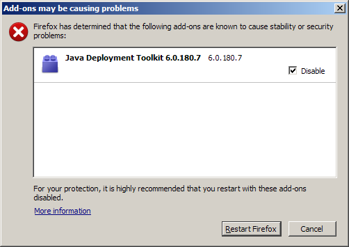

[**Oracle تطرح ترقيعاً أمنياً لثغرة Java Deployment Toolkit الجديدة**](https://www.it-scoop.com/2010/04/Oracle-releases-emergency-java-patch)

منذ أسبوع مضى، زعمت Oracle بأن الثغرة المكتشفه في Java ليست بالأمر الخطير على الإطلاق. على ما يبدو، فإن المسؤولين [أعادوا التفكير وغيّروا رأيهم حول هذا](http://www.oracle.com/technology/deploy/security/alerts/alert-cve-2010-0886.html).

قامت Oracle منذ يومين بطرح ترقيع أمني يخص Java Deployment Toolkit التي [كنا قد كتبنا خبراً حول الثغرة المكتشفة فيها](https://www.it-scoop.com/2010/04/java-deployment-toolkit-vulnerability/) والتي تسمح للمهاجم بتنفيذ كود ضار بصورة شرعية من خلال أي متصفح طالما أن الـ JDK مثبتة على جهاز المستخدم لأن  الـ JDT يتم تثبيتها بصورة افتراضية فيها.

الترقيع الذي تم طرحه يقوم بإصلاح هذه الثغرة جاعلاً المستخدمين (بما فيهم أنا) يتنفسون الصعداء!

إحدى الأمور التي لاحظتها البارحة، أن متصفح Firefox أظهر تحذيراً أمنياً لي يخبرني فيه بأن Java Deployment Toolkit مثبته وأنها خطيرة وينصحني بتعطيلها، هذه إحدى الميزات الرائعة في متصفح Firefox. فيما يلي  صورة  للرسالة التحذيرية التي قد تحصل عليه عزيزي القارئ

الإصدار الجديد من Sun Java 1.6.0 update 20 متوفر الآن للتحميل من [موقع Java الرسمي](http://www.java.com/inc/BrowserRedirect.jsp?locale=en&host=www.java.com).

يمكنكم أيضاً قراءة التفاصيل والملاحظات المتعلقة بهذا الإصدار عبر [الرابط](http://java.sun.com/javase/6/webnotes/6u20.html).
