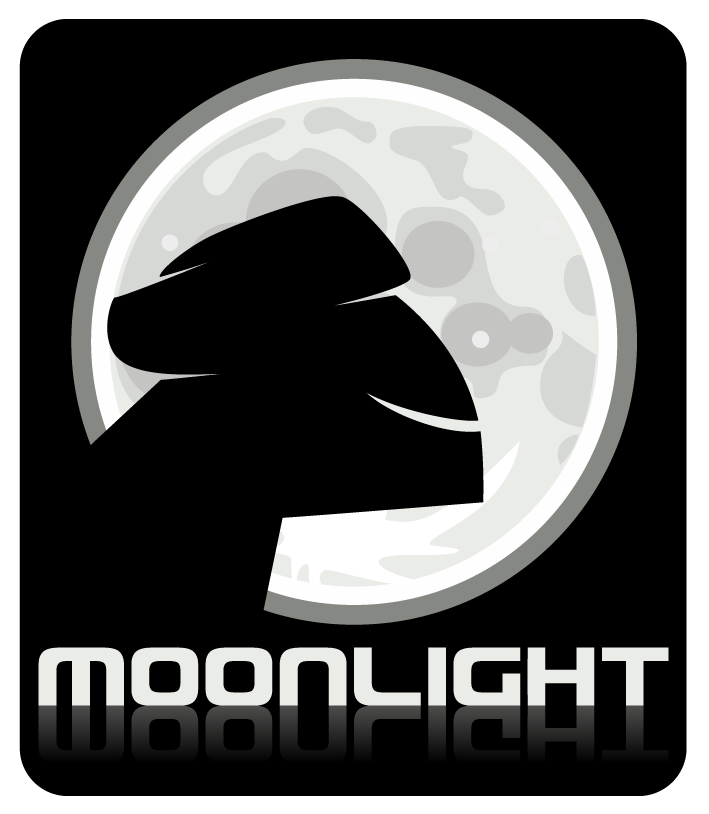

[**Novell تطلق إصدارا تجريبيا آخر لـ Moonlight، و الذي يشمل أغلبية خواص Silverlight 3**](https://www.it-scoop.com/2010/04/moonlight-3-preveiw-6/)

العمل على Moonlight  الإصدار مفتوح المصدر لـ Silverlight قائم على قدم و ساق، حيث أعلن Miguel de Icaza القائم على المشروع المدعوم من طرف Novell عن توفر الـ Preview السادس لـ Moonlight 3 و الذي يشمل أغلبية الخواص الموجودة في Silverlight 3 ، و خاصة ما تعلق منها بكتابة تطبيقات تعمل خارج المتصفح.

كما جاء هذا الإصدار بترقيعات للعديد من العلل في الإصدارات السابقة، إضافة إلى التوافق مع متصفح Chrome و هو الأمر الذي كان في السابق مقتصرا على متصفح Firefox

و على صعيد آخر، فإن الإصدار الثالث من البرنامج التجاري MonoTouch أصبح داعما للإصدار الرابع من نظام تشغيل iPhone 0S 4.0  ، و الذي يدعم أغلب ما أضافته Apple إلى نظامها ، على غرار دعم إعلانات  iAd و الـ Multitasking.

الـ Preview السادس لـ Moonlight 3.0 متوفر للتحميل لنظام Linux بشقيه 32 bit و 64 bit من [هنا](http://go-mono.com/moonlight/prerelease.aspx)

أما MonoTouch  فهو متوفر للشراء من على موقعه الرسمي من [هنا](http://monotouch.net/)
