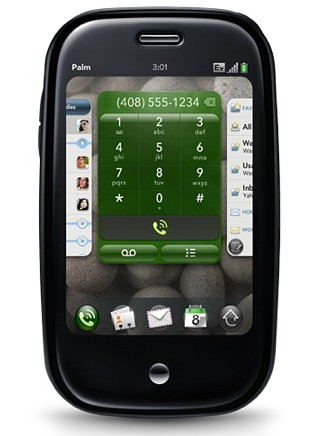

[**باحثون أمنيون يخترقون نظام WebOS الخاص بأجهزة Palm برسائل SMS بسيطة**](https://www.it-scoop.com/2010/04/Palm-WebOS-Hacked-Via-SMS-Messages)

كشف باحثون أمنيون يعملون لدىIntrepidus  عن ثغرة أمنية تسمح باختراق نظام تشغيل WebOS المستخدم على أجهزة Palm و هذا بإرسال رسائل SMS إلى جهاز الضحية.

الثغرة تكمن في مستوى الوحدة المسؤولة عن الـ SMS في الإصدار 1.3.5 من نظام WebOS حيث أنها لا تقوم بفلترة محتوى الرسائل كما يجب قبل فتحها و هو ما يمكن من إرسال أي نوع من المحتويات عبر الـ SMS، حيث تمكن الباحثون من حقن شيفرات HTML داخل الرسائل تمكنهم من الحصول على مبتغاهم.

حسب ما نشره الباحثون، فإن المشكل يرجع في جذوره إلى كون نظام WebOS عبارة عن متصفح ويب قبل كل شيء، و أن تطبيقاته مكتوبة بالـ HTML و الـ Javascript، مما يسمح لدى حقن شيفرات HTML من فتح مواقع معينة، أو تنفيذ بعض الأوامر.

للتذكير فإن الإصدار الحالي من نظام WebOS  هو [1.4.1.1](http://kb.palm.com/wps/portal/kb/na/pre/p100eww/sprint/solutions/article/50607_en.html#141) و التي لا تحتوي على هذه الثغرة، بحكم أن الباحثين لم يكشفوا عنها إلا بعد أن تم إبلاغ Palm و قامت بتصحيح الثغرة.

الفيديو التالية توضح 6 سيناريوهات مختلفة طبقها الباحثون لتوضيح الثغرة و كيفية استغلالها:

<!-- more -->

<object classid="clsid:d27cdb6e-ae6d-11cf-96b8-444553540000" width="640" codebase="http://download.macromedia.com/pub/shockwave/cabs/flash/swflash.cab#version=6,0,40,0" height="385"><embed src="http://www.youtube.com/v/SfDRSsh-Ccc&hl=fr_FR&fs=1&" allowscriptaccess="always" height="385" width="640" allowfullscreen="true" type="application/x-shockwave-flash"></embed></object>

يمكن قراءة المزيد عن الثغرة من [هنا](http://intrepidusgroup.com/insight/2010/04/webos-examples-of-sms-delivered-injection-flaws/)
