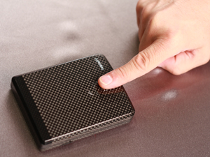

[**للمزيد من الحماية... محفظة شخصية تعمل عن طريق البصمة !**](https://www.it-scoop.com/2010/04/biometric-wallet/)

منذ بضع سنوات بدأنا نلاحظ توجه شركات صنع الحواسب المحمولة إلى إضافة تقنيات الحماية biometric كالتحقق بالبصمة إلى الأجهزة، لكن اليوم ستكون المرة الأولى التي نرى فيها حماية biometric خاصة بالمحفظات الشخصية!

حيث قامت شركة Aegis Innovations بتصميم محفظة مزودة بتقنيات حماية التحقق من الهوية biometric ليحافظ مالكو هذه المحافظ على محتوياتها بأمان.

TungstenW (اسم الموديل الذي أطلق على المحفظة) تملك غلافاً قاسياً والذي يفتح فقط عندما يتم التحقق من بصمة صاحبها. لكن كيف يتم إعداد البصمة ؟

يحتاج مقتنو هذه المحفظة للمرة الأولى لتوصيلها بالحاسب لإعداد بصمتهم (محفظة توصل بالحاسب :))

من النواحي الجميلة في المحفظة أيضاً أنه يمكن ربطها بهاتف صاحبها بتقنية Bluetooth. هذا الأمر يجعل المحفظة تطلق إنذاراً ما أن تبتعد عن مالكها لمسافة أكبر من 10 أقدام (مجال تغطية Bluetooth).

سرقة المحفظة ستجعل السارق يغرق في عرقه قبل أن يفكر حتى بخلع الغلاف!

تأتي المحفظة بعدة ألوان، ويستطيع المستخدمون الاختيار بين المصممة بالألياف الزجاجية أو ألياف الكربون و الكيفلر. تتراوح أبعاد TungstenW بين 3 3/8" عرض × 4 1/4" طول × 3/4" سماكة.

يمكن الإطلاع على مصدر الخبر من خلال [الرابط](http://www.mydigitallife.info/2010/04/23/biometric-wallet-for-added-security/).

- ما هي الأشياء التي نستعملها يوميا و تود لو تتم إضافة خاصية التعرف عن طريق البصمة إليها؟ فرشاة أسنان مثلا :) ؟
