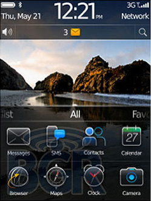

[**RIM تكشف النقاب عن Blackberry OS 6.0، و تعلن عن إطلاقه في الربع الثالث من العام الحالي**](https://www.it-scoop.com/2010/04/blackberry-os-6-0/)

كشفت RIM الكندية المصنعة لهواتف BlackBerry  عن الإصدار 6.0  من نظام  تشغيل Blackberry OS و الذي من المقرر إطلاقه خلال الربع الثالث من العام  الحالي.

سيتم تدعيم الإصدار القادم من Blackberry OS بمتصفح جديد مبني على محرك Webkit و الذي يتم استعماله حاليا على كل من الـ Android و أجهزة الـ iPhone.

لم يتم الكشف بعد عن تفاصيل أوفى عن النظام الجديد، لكن خلال مؤتمر WES 2010 أراد Mike Lazaridis المدير التنفيذي لـ RIM أن يعطي الانطباع على جدية الموضوع، حيث قرن الإعلان على النظام الجديد بكل من عدد أجهزة BlackBerry التي تم بيعها عبر مختلف أنحاء العالم و التي وصلت إلى 90 مليون جهاز، إضافة إلى وتيرة التحميل من App World  متجر تطبيقات الـ BlackBerry و التي وصلت إلى مليون تحميل يومي.

يمكن قراءة المزيد عن الخبر من [هنا](http://blogs.zdnet.com/BTL/?p=33725)
