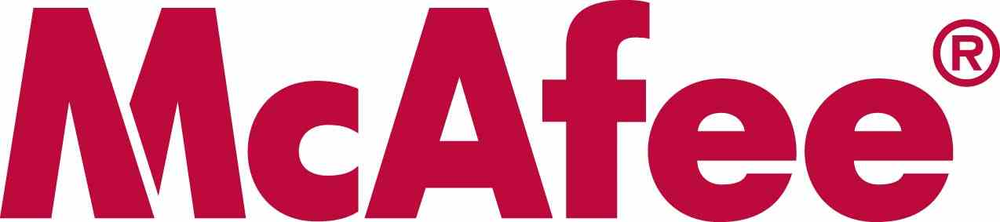

[**McAfee تقرر تعويض بعض المتضررين من المشاكل التي سببها تحديثها الأمني**](https://www.it-scoop.com/2010/04/McAfee-promises-reimburse-consumers-bad-update)

بعد أن فعلت McAfee فعلتها و قامت [بنشر تحديث أمني في الـ 21 من الشهر الحالي](../../../../../2010/04/mcafee-false-positive-bricks-enterprise-pcs/) و الذي تسبب في مشاكل للعديد من زبائنها المستعملين لحلولها و خاصة من الشركات، و في خطوة منها لتلميع صورتها قررت McAfee تعويض بعض من المتضررين جراء ذلك، شريطة أن تكون التعويضات "منطقية".

حيث أشارت McAfee إلى أنها تنوي تقديم تعويضات للمبالغ المدفوعة للفنيين لتصحيح الوضع، مما يعني وجوب تقديم وثائق تثبت ذلك، دون أن تحدد  أي قيمة قصوى للتعويض،إضافة إلى إهدائهم نسخة مجانية لمدة سنتين لمضاد الفيروسات الخاصة بها.

للتذكير فإن McAfee قد نشرت منذ أيام تحديثا أمنيا  تسبب في ما يعرف بـ False positive حيث أنه تم إعلان أحد ملفات النظام على أنها برنامج ضار مما تسبب في توقف آلاف الأجهزة التي تعمل على Windows XP SP3 حول العالم و التي تستخدم VirusScan Enterprise 8.7i SP3.

يمكن قراءة إعلان McAfee عن التعويضات من [هنا](http://us.mcafee.com/en-us/landingpages/np5959.asp?cid=77220)
