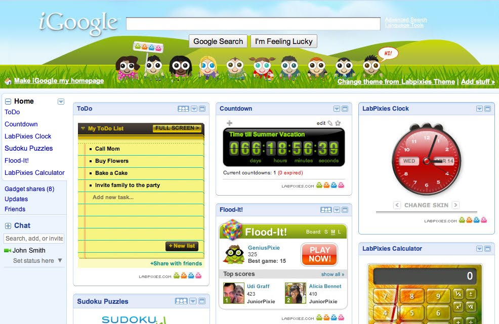

[**Google  تشتري Labpixies الإسرائيلية المتخصصة في الـ Widgets**](https://www.it-scoop.com/2010/04/google-acquires-labpixies/)

تواصل Google عمليات شرائها الشهرية، و هذه المرة مع شركة Labpixies الإسرائيلية و التي تتخصص في الـ Widgets.

تقوم شركة Labpixies بكتابة التطبيقات و الـ Widgets  للكل من الشبكات الاجتماعية على غرار Facebook  و MySpace ، أنظمة تشغيل الهواتف كالـ iPhone و الـ Android، و تعتبر أول شركة توفر أدوات إضافية لخدمة iGoogle التي تم إطلاقها سنة 2005.

لم يتم الكشف عن قيمة العرض الذي حازت به Google على شركة Labpixies، لكن تشير Google إلى أن Labpixies ستنضم إلى مكاتبها في تل أبيب و ستعمل على iGoogle الموجه لكل من أوروبا، الشرق الأوسط و إفريقيا.

يمكن قراءة الإعلان الرسمي لشراء Google لـ Labpixies من على مدونة Google من [هنا](http://googlecode.blogspot.com/2010/04/google-acquires-labpixies.html) أو على موقع Labpixies من [هنا](http://www.labpixies.com/)

-   كيف تنظر إلى عملية الشراء هذه؟

-   هل سنرى و نسمع قريبا عن شركات مسلمة يتم شراؤها من طرف Google ؟

-   هل سيحرك هذا الخبر بعض أولي الألباب للتحرك لإنشاء مشاريع و خدمات ترقى إلى مستوى الكبار؟
