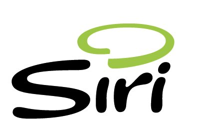

[**Apple تشتري شركة Siri صاحبة تطبيق Siri Assistant المتخصص في البحث الصوتي**](https://www.it-scoop.com/2010/04/apple-acquires-siri/)

تواصل Apple عمليات شراء الشركات الناشئة، و هذه المرة ضمت إليها شركة Siri صاحبة تطبيق Siri Assistant المتخصص في البحث عن طريق الصوت في صفقة يعتقد المحللون أن قيمتها ستكون ما بين 100 و 200 مليون دولار.

تطبيق Siri Assistant و المتوفر حاليا في الولايات المتحدة فقط، يقوم على أساس أن يطرح عليه المستخدم أسئلة و يتولى هو البحث عن إجابة، حيث يعتمد على مواقع متخصصة للقيام بذلك،حيث تظهر الفيديو التعريفية بالتطبيق (انظر أدناه) كيف يقوم المستخدم بطرح أسئلة عن  أقرب مطعم، أو دور العرض التي تعرض فيلما معينا، و ما إلى ذلك من أسئلة الحياة اليومية، و كيف يقوم التطبيق بالإجابة عليها.

لم تبين Apple كعادتها نيتها من وراء شراء Siri  و تطبيقها Siri Assistant، لكن العديد من المؤشرات توحي بأن شركة التفاحة المقضومة ستقوم بتضمين التقنية التي ستحصل عليها من وراء عملية الشراء هذه في الجيل القادم من هواتف iPhone و هو ما يعني -كما ذكرنا سابقا- أن التنافس بين Apple و Google يشتد يوما بعد يوم، إذ أن كل طرف بدأ يصطاد في محمية الآخر، حيث أن Google دخلت بقوة في ميدان الهواتف الذكية، و Apple ترد على ذلك بدخولها عالم محركات البحث.

الفيديو التالية تبين خصائص تطبيق Siri Assistant :

<!-- more -->

<object classid="clsid:d27cdb6e-ae6d-11cf-96b8-444553540000" width="640" codebase="http://download.macromedia.com/pub/shockwave/cabs/flash/swflash.cab#version=6,0,40,0" height="385"><embed src="http://www.youtube.com/v/MpjpVAB06O4&hl=fr_FR&fs=1&" allowscriptaccess="always" height="385" width="640" allowfullscreen="true" type="application/x-shockwave-flash"></embed></object>

يمكن قراءة المزيد عن عملية شراء Apple لـ Siri من [هنا](http://content.usatoday.com/communities/technologylive/post/2010/04/apple-acquires-mobile-search-company-siri/1)
