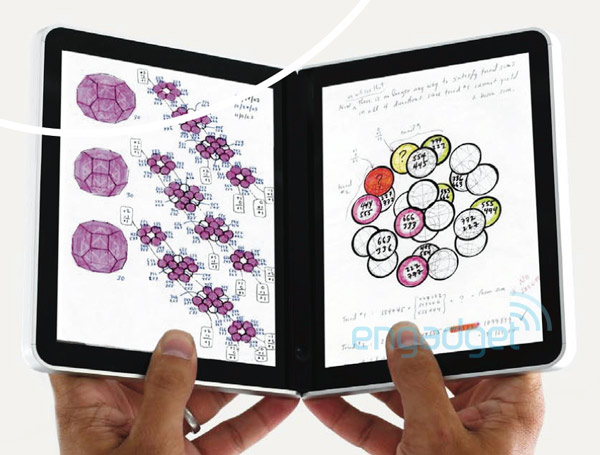
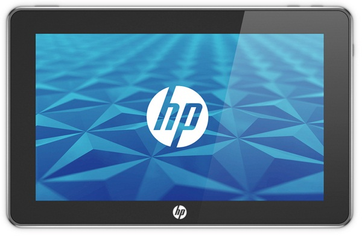

[**Microsoft و HP تلغيان مشروعي جهازيهما اللوحيين Courier و Slate**](https://www.it-scoop.com/2010/04/courier-slate-scrapped/)

الظاهر أن الـ iPad سيحظى بفترة أخرى من دون منافسة قوية، فقد أعلنت Microsoft أنه سيتم إيقاف العمل على جهازهااللوحي Courier الذي كثر الحديث عنه ، و أن الأمر لا يعدو كونه مثالا عما تستطيع Microsoft فعله.

كما أشارت مدونة TechCrunch إلى أن مصادرها المقربة من ملف الجهاز اللوحي Slate أكدت لها أن HP قد قررت توقيف العمل عليه، حيث تبين بعد توزيع بعض النماذج الأولية أن معالجات Intel Atom المستعملة تستهلك الكثير من الطاقة، كما أن نظام Windows 7 أبعد ما يكون من النظام الأمثل لجهازها اللوحي.

و في نفس السياق،  فإن شراء HP لـ Palm و الذي سمح لها بأن تضع يدها على نظام WebOS قد يكون أحد الأسباب التي جعلت HP إيقاف تصنيع Slate بنسختها الحالية، و ربما سنسمع قريبا بجهاز لوحي آخر لـ HP يكون مجهزا بنظام WebOS.

يمكن قراءة إعلان Microsoft عن إيقاف مشروع Courier من [هنا](http://blogs.technet.com/microsoft_blog/archive/2010/04/29/speculation-about-the-courier-project.aspx) ، كما يمكن الإطلاع على خبر TechCrunch من [هنا](http://techcrunch.com/2010/04/29/hewlett-packard-to-kill-windows-7-tablet-project/)
