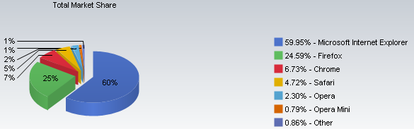

[**Chrome يتقدم بخطى ثابتة، Internet Explorer يواصل تراجعه، حسب آخر إحصائيات لـ NetApplications**](https://www.it-scoop.com/2010/05/Browser-Market-Share-April-2010)

أشارت آخر إحصائيات لـ NetApplications أن متصفح Internet Explorer بجميع إصداراته قد تراجع إلى ما دون نسبة 60%، فيما يواصل Chrome مسيرته للوصول إلى نسبة 10% التي سطرتها Google كهدف لها بخطوات ثابتة.

حسب هذه الإحصائيات فقدْ فقدَ Internet Explorer  ما يقدر بـ 0.70%  من نسبة الاستعمال العالمي خلال شهر واحد حيث أصبحت حصته 59.95%، بعد أن كانت تقدر لـ 68.32%  في يونيو من العام المنصرم، و يبقى الإصدار الثامن منه الأوفر حظا بنسبة 24.66%، فيما يواصل الإصدار السادس صموده بـ 17.58% .

و فيما يخص Firefox فقد سجلت تقدما لا بأس به جعل حصته تقدر بـ 24.59%  و هو ما جعله يحافظ على مرتبته الثانية.

أما فيما يخص Chrome فقد سجلت حصة تقدر بـ 6.73% و هو ما يمثل زيادة قدرها 0.60% و هو الذي لم تكن حصته منذ عام تزيد هم 1.79%.

يمكن الإطلاع على كامل إحصائيات NetApplications من [هنا](http://marketshare.hitslink.com/browser-market-share.aspx?qprid=0)

- ما هو المتصفح الذي تستعمله؟ و لماذا؟

- هل تكتفي بمتصفح واحد فقط؟
