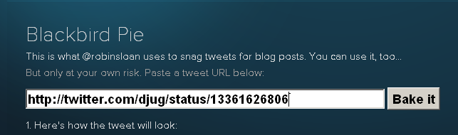

[**Twitter تطلق خدمة Blackbird pie لتضمين الـ tweets في صفحات الويب**](https://www.it-scoop.com/2010/05/twitter-launches-blackbird-pie/)

أطلقت Twitter خدمة جديدة و التي أطلقت عليها اسم Blackbird pie، حيث تسمح بتضمين الـ tweets في صفحات الويب دون الحاجة إلى تحويلها إلى صور.

قبل إطلاق هذه الخدمة كان لمن أراد تضمين tweets معينة في صفحة ويب اللجوء إلى طرق "ملتوية" للقيام بذلك، حيث كان يجب عمل screenShot و بعدها يقوم بتقطيع الصورة الناتجة و رفعها على خادم الموقع (أو أي خادم آخر) ليتسنى إظهارها على الموقع.

الخدمة الجديد تتيح لك بمجرد تمرير رابط الـ tweet  الذي تود نشره الحصول على شيفرة HTML التي يمكن تضمينها في أية صفحة web.
يمكن الإطلاع على هذه الخدمة من [هنا](http://media.twitter.com/blackbird-pie/)
