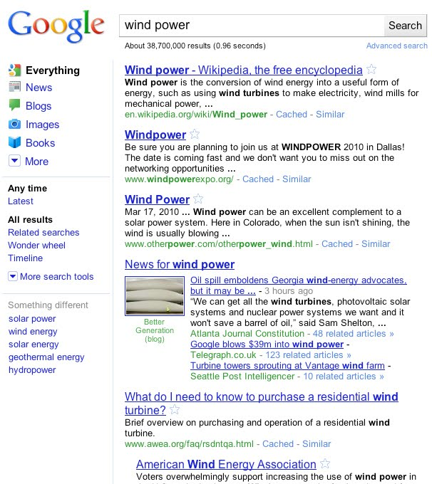

[**Google تدخل تغييرات على واجهة محرك بحثها**](https://www.it-scoop.com/2010/05/google-new-look/ )

أعلنت Google أمس عن تغييرات جديدة تخص واجهة محرك البحث، و التي من شأنها أن تجعل من عملية البحث على الإنترنت عَمَلية و أكثر سهولة.

أهم ما جاء في هذه التغييرات هو استحداث قائمة جانبية تمكن الباحث من التنقل بين مختلف أنواع النتائج. و نرى في الفيديو المرفقة مع إعلان Google  كيف يمكن الانتقال بكل سلاسة ما بين نتائج البحث في الأخبار أو في الصور، أو في كل أنواع المحتويات الممكنة و التي يمكن لـ Google البحث من خلالها.

كما تتيح الواجهة الجديدة  التحكم عمر نتائج البحث بسلاسة أكبر، حيث يمكن اختيار نتائج البحث المضافة في الأربع و عشرين ساعة الماضية بنقرة واحدة.

قد لا تكون الواجهة الجديدة ظاهرة في جميع أنحاء العالم الآن، لكنه سيتم تعميم ذلك في غضون الساعات القليلة القادمة

الفيديو التالية توضح خواص في واجهة Google الجديدة.

<!-- more -->

<object classid="clsid:d27cdb6e-ae6d-11cf-96b8-444553540000" width="640" codebase="http://download.macromedia.com/pub/shockwave/cabs/flash/swflash.cab#version=6,0,40,0" height="385"><embed src="http://www.youtube.com/v/C-rnxNFRAQA&hl=fr_FR&fs=1&" allowscriptaccess="always" height="385" width="640" allowfullscreen="true" type="application/x-shockwave-flash"></embed></object>

يمكن الإطلاع على إعلان Google على الواجهة الجديدة من [هنا](http://googleblog.blogspot.com/2010/05/spring-metamorphosis-googles-new-look.html?utm_source=feedburner&utm_medium=feed&utm_campaign=Feed:+blogspot/MKuf+%28Official+Google+Blog%29&utm_content=Google+Reader)
