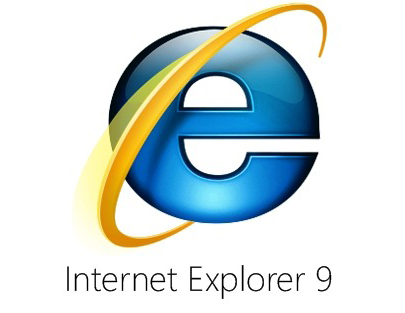

[**Microsoft تؤكد عدم توافقية Internet Explorer 9 مع نظام Windows XP**](https://www.it-scoop.com/2010/05/Microsoft-confirms-IE9-will-shun-Windows-XP)

أكدت Microsoft خلال الـ Web 2.0 Expo  المنعقد بحر هذا الأسبوع أن الإصدار 9 من Internet Explorer  لن يكون متوافقا مع نظام Windows XP.

وعللت Mirosoft ذلك بإن متصفح Internet Explorer 9 سيستعمل الـ hardware acceleration و الذي -حسب زعمها- يحتاج إلى نظام تشغيل حديث للقيام بذلك.

لكن العديد من الحقائق تشير إلى أن حجة Microsoft واهية، حيث أن كلا من متصفحي Chrome و Opera يعتمدان نفس الـ hardware acceleration و هذا بالرغم من استعمالهما على نظام Windows XP، مما يشير بكل وضوح أن عدم توافقية IE9 مع windows XP ما هي إلى حيلة جديدة من Microsoft لدفع مستخدمي هذا الأخير للانتقال إلى أنظمتها الأحدث و بالأخص Windows 7.

للتذكير فإن نظام Windows XP لا يزال يتربع على عرش أنظمة التشغيل على المستوى العالمي، حيث تشير إحصائيات NetApplications إلى أنه يحوز على نسبة 63%، و هو ما يجعل خطوة Microsoft بجعل IE9 غير متوافق مع XP غير واضحة المعالم.

يمكن قراءة المزيد عن الأمر من [هنا](http://www.computerworld.com/s/article/9176396/Microsoft_pushes_users_to_ditch_XP_with_IE9_plans_says_analyst)
