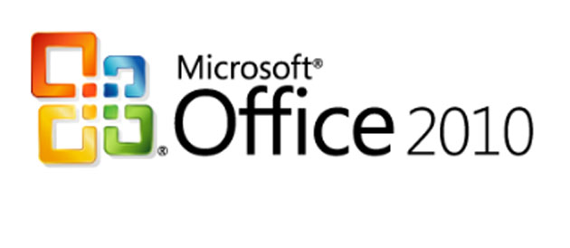

[**Microsoft  تطلق Office 2010 للشركات**](https://www.it-scoop.com/2010/05/microsoft-office-2010/)

أطلقت Microsoft اليوم حزمتها المكتبية Office 2010  الموجهة للشركات في مختلف أنحاء العالم، فيما ينبغي للأفراد الانتظار إلى غاية الـ 15 من شهر يونيو القادم.

الإصدار 2010  من حزمة Office هي الأولى التي تأتي على ثلاث أشكال مختلفة، حيث أنه و بالإضافة إلى الشكل الكلاسيكي للحزمة و المتمثل في تطبيقات سطح المكتب، نجد كلا من إصدار على هيئة تطبيق ويب (Office Web Apps) و تطبيق على الهواتف الذكية، و التي ستكون متوافقة مع أنظمة Windows Mobile 6.5 و Windows Phone 7 إضافة إلى Symbian.

إتاحة حزمة Office 2010 على هيئة تطبيق ويب سيسمح لـ Microsoft منافسة خدمة  Google Apps و التي تتيح هي الأخرى تحرير و مشاركة الملفات عبر الإنترنت، و هو الأمر الذي قد يكون أحد الأسباب التي دفعت Google اليوم إلى [نشر تدوينة على مدونتها الموجهة للشركات](http://googleenterprise.blogspot.com/2010/05/upgrade-here.html)، تنصحهم فيها بعدم الترقية إلى  الإصدار 2010 من حزمة Office، حيث  عقدت مقارنة بين استعمال إصداري 2003 و 2007 من Office مع Google Doc  من جهة، و من جهة أخرى الانتقال إلى Office 2010، و تشير كل أوجه المقارنة –حسب Google-  إلى وجوب عدم الترقية.

للتذكير فإن Google قد سبق لها و أن [اشترت تطبيق DocVerse](../../../../../2010/03/google-%D8%AA%D8%B6%D9%85-%D8%B1%D8%B3%D9%85%D9%8A%D8%A7-docverse-%D8%A5%D9%84%D9%8A%D9%87%D8%A7%D8%8C-%D9%88-%D8%AA%D8%A8%D8%AF%D8%A3-%D9%85%D9%86%D8%A7%D9%81%D8%B3%D8%A9-%D8%BA%D9%8A%D8%B1-%D9%85/) و الذي يسمح بمشاركة والعمل الجماعي على ملفات حزمة Office عبر الإنترنت.
