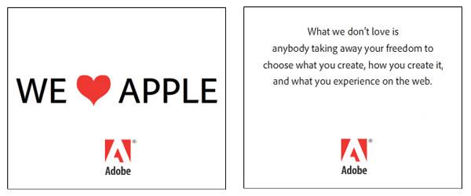

[**بعد أن لوحت Apple بالطلاق، Adobe تغازلها من جديد على صفحات موقع engadget**](https://www.it-scoop.com/2010/05/Adobe-targets-Apple-ad-campaign)

بعد الشقاق الذي حدث بينهما، و ذم Apple لتقنيات Adobe و خاصة الـ Flash و بعد أن ظهرت بوادر تحضير Apple لمنتج منافس لـ Flash، قررت Adobe أن تغازل Apple من جديد و هذه المرة أعلنتها صراحة على صفحات موقع engadget الشهير.

الرسالة واضحة وضوح الشمس، و Adobe تحاول استعطاف Apple من جديد حيث تعلن أنها تحب Apple لكنها لا تحب أن يتم فرض القيود حول كيفية كتابة التطبيقات و الطرق المستعلمة في ذلك في إشارة واضحة إلى القيود الجديدة التي فرضتها Apple للتطبيقات التي تخص نظام iPhone OS المستعملة على هواتف الـ iPhone و أجهزة الـ iPad.

يمكن الإطلاع على التدوينة الخاصة بالإعلان على موقع engadget من [هنا](http://www.mac4ever.com/news/54340/adobe_lance_une_campagne_de_pub_pro_apple_et_pro_flash/)

-   هل أصابك الذهول لمشاهدتك لهذا الإعلان؟ عبر عن شعورك :)

-   هل ترى أن خطوة Adobe منطقية؟ أم أنها ضرورية لتجنب أضرار مقاطعة Apple لها؟
