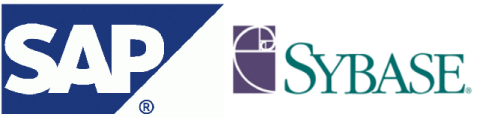

[**شركة SAP  الألمانية تضم إليها Sybase الرابعة عالميا في مجال قواعد البيانات**](https://www.it-scoop.com/2010/05/sap-buys-sybase/)

أعلنت شركة SAP الألمانية الرائدة في مجال الـ ERP و المصنفة الأولى أوروبيا في مجال البرمجيات عن شرائها لشركة Syabase صاحبة نظام إدارة قواعد البيانات الذي يحمل نفس الاسم و المصنفة الرابعة عالميا في مجال قواعد البيانات و التي تأتي بعد كل من Oracle، DB2 و SQL Server.

تقدر عملية الشراء هذه بـ 5.8 مليار دولار و التي تمثل زيادة قدرها 44% من مجموع متوسط أسهم Sybase  خلال الأشهر الثلاثة الأخيرة.

قد يكون أهم ما جعل SAP تفكر في شراء شريكها Sybase هو جملة الحلول التي تقدهما هذه الأخيرة و التي تخص عالم الهواتف الذكية، حيث عرف هذا القطاع نموا متزايدا لدى Syabase. كما أن عملية الشراء هذه ستحرر SAP من حاجتها إلى خدمات Oracle بحكم أن Sybase تملك حلولا خاصة بأنظمة إدارة قواعد البيانات.

يمكن قراءة الإعلان الرسمي لشراء SAP لـ Sybase من [هنا](http://www.sap.com/about/newsroom/press-releases/press.epx?pressid=13202)
