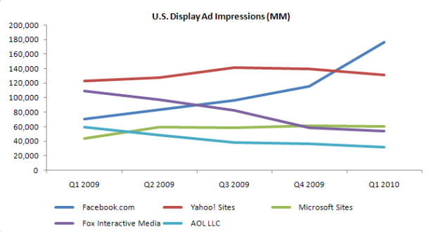

[**Facebook يتجاوز Yahoo في عدد الإعلانات المصورة في الولايات المتحدة**](https://www.it-scoop.com/2010/05/Facebook-overtakes-Yahoo-display-Ads)

ذكر تقرير أعدته ComScore أن عدد الإعلانات المصورة (banners) المعروضة على الشبكة الاجتماعية Facebook يتجاوز لأول مرة Yahoo في الولايات المتحدة  خلال الربع الأول من العام الحالي و يحتل بذلك المرتبة الأولى.

لكن و بالرغم من احتلال Facebook الصدارة  إلا أن عوائد Yahoo  خلال نفس الفترة لا تزال في صدارة العوائد  المسجلة من هذه الإعلانات مما يقلل بعضا من أهمية فقدان Yahoo للمرتبة الأولى .

حسب هذا التقرير فإنه تم عرض 1,1 مليار إعلان مصور (banners) خلال الأشهر الأربعة الأولى من العام الجاري في الولايات المتحدة ، و قدرت حصة Facebook  منها بـ 16.2% أي ما يمثل 176 مليون إعلان.

تجدر الإشارة إلى أن الشبكة الاجتماعية Facebook تسجل نمواُ متزايداُ في عدد الإعلانات المعروضة عليها، و يرجع الأمر إلى الزيادة المستمرة لعدد مستخدميها و الذين يتجاوزون الـ 400 مليون مستخدم، إضافة إلى أسعار الإعلانات على Facebook المنخفضة مقارنة بالشبكات الاجتماعية الأخرى، أو المواقع الشهيرة على غرار Yahoo.

يمكن الإطلاع على تقرير ComScore من [هنا](http://www.comscore.com/Press_Events/Press_Releases/2010/5/Americans_Received_1_Trillion_Display_Ads_in_Q1_2010_as_Online_Advertising_Market_Rebounds_from_2009_Recession)، قما يمكن قراءة تحليل الـ wall street journal  للوضع من [هنا](http://online.wsj.com/article/SB10001424052748704250104575238661210740510.html)
