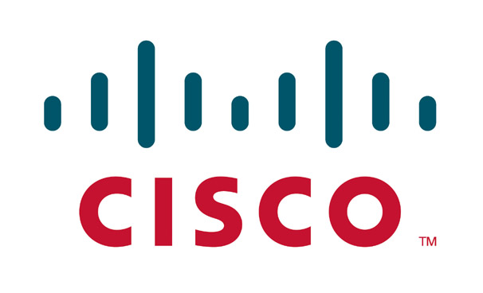

[**القضاء الأمريكي يحكم على Cisco بدفع 3.7 مليون دولار لشركة Commil لاستغلالها براءة اختراع تخصها**](https://www.it-scoop.com/2010/05/cisco-commil-patent/)

حكمت محكمة أمريكية على Cisco بدفع تعويض مقدر بـ 3.7 مليون دولار لصالح شركة Commil USA LLC و التي تتهمها باستغلال براءة اختراع لها من دون إذنها.

براءة الاختراع محل النزاع، تخص كيفية المحافظة على اتصال لاسلكي Wi-Fi أو Bluetooth خلال تحرك الجهاز في مبنى معين، حيث رفعت Commil دعوى قضائية ضد Cisco سنة 2007 مطالبة بتعويض قدرته حينها بـ 53 مليون دولار.

لم يصدر عن Cisco أية رد فعل بعد صدور الحكم، لكنها أبدت أكثر من مرة تشكيكها حول مدى صحة براءة الاختراع محل الشكوى.

يمكن الإطلاع على المزيد من حيثيات القضية من [هنا](http://www.businessweek.com/news/2010-05-18/cisco-told-to-pay-commil-3-7-million-over-patent-update1-.html)
