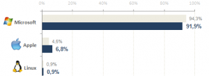

[**َ****Apple**** تتقدم ، ****Microsoft**** تتراجع و ****Linux**** لا يراوح مكانه، حسب آخر إحصائيات ****AT-Internet**](https://www.it-scoop.com/2010/05/os-market-share/)

حسب آخر إحصائيات لـ AT-Internet  فإن أنظمة Microsoft شهدت تراجعا في نسبة استعمالها للولوج إلى الإنترنت خلال شهر أبريل المنصرم  مقارنة بنفس الفترة من العام الماضي، حيث شهدت تراجعا قُدِّر بـ 2.4% مما قلص مجموع حصصها إلى 91.9%.

حسب نفس الإحصائيات فإن أنظمة Apple شهدت تقدما بنفس النسبة تقريبا، حيث سجلت نموا قدر بـ 2.3% و هو مالا يمثل زيادة كبيرة، بالنظر إلى الـ  6.8% التي تمثل حصتها.

أما فيما يخص Linux فإن نسبة استعماله خلال شهر أبريل من العام الحالي هي نفسها في نفس الفترة من العام الماضي، هذا الأمر و إن كان يبعث على القليل من الارتياح (لعشاق هذا النظام) نظرا لعدم تراجع استعماله، إلا أنه في نفس الوقت لا يبشر بالخير، حيث أن مختلف توزيعات هذا النظام لم تستطع استغلال فرصة تأخر أنظمة Windows.

و فيما يخص أنظمة Microsoft، فلا يزال Windows XP هو المسيطر بنسبة قدرت بـ 55.6%، مقابل 22.4% لـ Vista. أما آخر "وليد" لها فقد سجل نسبة 12.3% .

تجدر الإشارة إلى أنه تم إعداد هذه الإحصائيات اعتمادا على ما تم استخلاصه من الزيارات لـ 16460 موقع موزعة على 23 بلدا أوروبيا، مما يعطي نظرة تقريبية على نسبة الاستعمال العالمي لأنظمة التشغيل الرئيسية للولوج إلى الإنترنت.

يمكن الإطلاع على تفاصيل إحصائيات AT-Internet كاملة من [هنا](http://www.atinternet-institute.com/fr-fr/equipement-internaute/systemes-d-exploitation-avril-2010/index-1-1-7-197.html)
