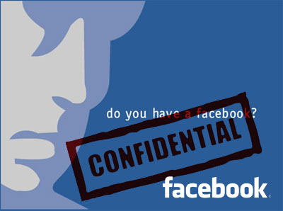

[**Mark Zuckerberg يعتذر عن الأخطاء المتعلقة بخروقات الخصوصية المرتكبة على Facebook**](https://www.it-scoop.com/2010/05/mark-zuckerberg-facebook-washington-post)

نشر Mark Zuckerberg على صفحات جريدة الـ washington post   اعتذارا عن السياسة التي انتهجتها شبكته الاجتماعية Facebook و المتعلقة بعدم احترام و خروقات متعلقة بخصوصية منتسبي الشبكة، إضافة إلى تعقيد آلية حماية البيانات الشخصية.

حيث صرح قائلا : "أعلم أننا اقترفنا جملة من الأخطاء، لكن أملي كان في أن نحسِّن من نوعية الخدمة التي نقدمها، و أود أن يعلم مشتركو الشبكة أن نوايانا كانت حسنة، و أننا سنتعامل مع ردود الفعل التي تصلنا".

و يضيف: " سنقوم خلال الأسابيع القادمة توفير آلية لحماية البيانات الشخصية أكثر بساطة و سهولة في الاستعمال"، كما أشار إلى أن هدف Facebook كان توفير آلية للتحكم أكثر في جميع تفاصيل البيانات المشتركة على الشبكة، لكن هذه الآلية لم تحقق هدفها (أخفقت) نظرا لدرجة تعقيدها.

قد يبدو أن إعلان Mark Zuckerberg هذا و خروجه عن صمته الذي لازمه لمدة لم يكن وليد الصدفة، بل قد يكون قد تعرض لضغوطات للقيام بذلك، و من بين الدلائل على ذلك هو الإعلان عن هذا الاعتذار على صفحات جريدة الـ washington post    و الذي يرأسها أحد أعضاء مجلس إدارة Facebook، و ليس عبر المدونة الرسمية للشبكة.

يمكن قراءة الاعتذار الذي نشره Mark Zuckerberg على صفحات الـ washington post   من [هنا](http://www.washingtonpost.com/wp-dyn/content/article/2010/05/23/AR2010052303828.html?wprss=rss_technology)
