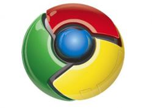

[**Google تطلق الإصدار النهائي لـ Chrome 5 و الذي لا يتضمن الـ Flash**](https://www.it-scoop.com/2010/05/google-chrome-5/ )

أطلقت Google الإصدار النهائي لـ Chrome5 لكل من أنظمة Windows، Linux و Mac في آن واحد.

يعتبر هذا الإصدار أول إصدار نهائي لكل من نظامي Mac و Linux حيث أن Google لم تطلق أية إصدارات نهائية من قبل لهذين النظامين، كما أنه لأول مرة يتم إطلاق إصدار جديد لهذه الأنظمة في آن واحد.

من ناحية المستجدات، لا نلاحظ أية مستجدات "هامة جدا"، سوى تعزيز أداء المتصفح، و دعم أفضل للـ HTML 5  إضافة إلى دعم الـ API الخاصة بالـ geolocation إلى جانب دعم سحب الملفات و إفلاتها على Gmail. لكن هناك خاصية تم الإعلان عنها سابقا و تضمينها في الإصدار Beta و لا تسجل حضورها في هذا الإصدار، و نقصد هنا تضمين الـ Flash مع المتصفح، و هو ما تم إرجاؤه إلى إصدارات قادمة.

العمل على الإصدار السادس قائم على قدم و ساق و قد بدأ الشروع فيه قبل إطلاق الإصدار النهائي لـ Chrome 5 و الذي يمكن تحميله من [هنا](http://www.google.com/chrome)

كما يمكن الإطلاع على إعلان Google الرسمي على إطلاق الإصدار النهائي لـ Chrome 5 من [هنا](http://chrome.blogspot.com/2010/05/new-chrome-stable-release-welcome-mac.html)
