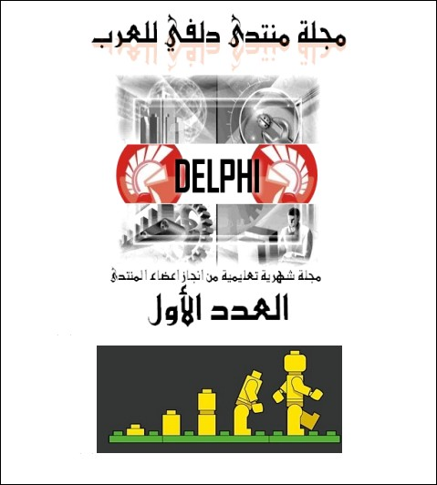

[**صدور العدد الأول من مجلة منتدى دلفي للعرب**](https://www.it-scoop.com/2010/06/delphi4arab-magazine/)

أطلق الصديق محمد عبد العزيز المعروف في الأوساط التقنية (و خاصة الدلفاوية منها) تحت مسمى B.M.AbdelAziZ  الإصدار الأول من مجلة منتدى دلفي للعرب.

مجلة منتدى دلفي للعرب مجلة شهرية من إنجاز أعضاء المنتدى ([منتدى Delphi للعرب](http://www.delphi4arab.com/forum/)) تعالج مواضيع تتعلق بالـ Delphi من قريب أو من بعيد و تمتاز بخفة أسلوبها من دون أن تكون سطحية، كما تمتاز باستعمالها لغة عربية فصيحة و سلسة.

<blockquote>فهرس العدد الأول

> 
> 
	  * افتتاحية
	  * قواعد البيانات :      الاستعلام      SQL
	  * مكونات دلفي : مكون ListView
	  * دلفي : إعادة      الاستخدام في دلفي
	  * تحليل البرمجيات :      استهداف دلفي
	  * تمرين العدد

</blockquote>

إذا كنت مهتما بالـ Delphi أو تود التعرف عليها أكثر ما عليك سوى تحميل المجلة من أحد الروابط التالية:

<blockquote>[www.delphi4arab.com/delphi/D4AMAG01.rar](http://www.delphi4arab.com/delphi/d4amag01.rar)

[http://rapidshare.com/files/394110724/D4AMAG01.rar](http://rapidshare.com/files/394110724/D4AMAG01.rar)

[http://hotfile.com/dl/45964047/d779fa7/D4AMAG01.rar.html](http://hotfile.com/dl/45964047/d779fa7/D4AMAG01.rar.html)

[http://www.megaupload.com/?d=8U8FSF9M](http://www.megaupload.com/?d=8U8FSF9M)

[http://www.zshare.net/download/767681668bc38fe4/](http://www.zshare.net/download/767681668bc38fe4/)

[http://depositfiles.com/en/files/e5qgmnepo](http://depositfiles.com/en/files/e5qgmnepo)

[http://www.2shared.com/file/sY63jYqI/D4AMAG01.html](http://www.2shared.com/file/sY63jYqI/D4AMAG01.html)

[http://www.badongo.com/file/23049124](http://www.badongo.com/file/23049124)</blockquote>

و إن كنت مهتما بالمشاركة في تحرير الأعداد القادمة من المجلة ما عليك سوى التسجيل في المنتدى و اقتراح مواضيعك ليتم نشرها في الأعداد القادمة

عنوان منتدى دلفي للعرب:

[http://www.delphi4arab.com](http://www.delphi4arab.com/)
