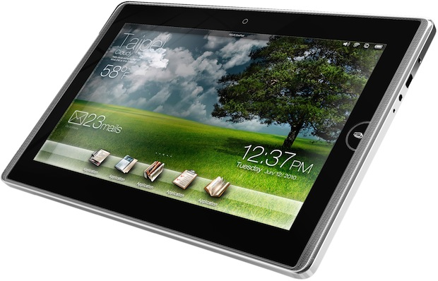

[**Microsoft تكشف النقاب عن Windows Embedded compact 7، نسخة خفيفة من نظام Windows 7 للأجهزة اللوحية**](https://www.it-scoop.com/2010/06/Microsoft-Launches-Windows-Embedded-Compact-7)

كشفت Microsoft النقاب عن نظام Windows Embedded compact 7 و الذي يعتبر نسخة خفيفة من نظام Windows 7 الموجهة للأجهزة المحمولة عموما و للأجهزة اللوحية خصوصا، و ذلك في مؤتمر Computex 2010 المنعقد حاليا في تايبيه التايوانية.

هذا الإصدار من نظام Windows 7 موجه بصورة أكبر للأجهزة اللوحية و التي قد يكون من الصعب أن يستطيع أي نظام جديد منافسة الأنظمة الحالية  و المتمثلة حاليا في كل من iPhone OS، Android و MeeGo.

بالرغم من أن Microsoft لم تكشف سوى عن  الإصدار CTP (Community Technology Preview) من نظام Windows Embedded compact 7 ، إلا أن العديد من المصنعين أبدوا اهتمامهم به و خاصة Asus و التي من المرتقب أن تطلق جهازها اللوحي Eee Pad خلال الربع الأول من العام القادم و الذي يسكون مجهزا بهذا النظام.

يمكن معرفة المزيد عن هذا نظام Windows Embedded compact 7  من [هنا](http://www.osnews.com/story/23388/Microsoft_Launches_Windows_Embedded_Compact_7_CTP)

- هل تظن أن هناك أية فرص لـ Microsoft لتعود إلى سوق الأجهزة اللوحية بفضل نظام Windows Embedded compact 7  ؟
