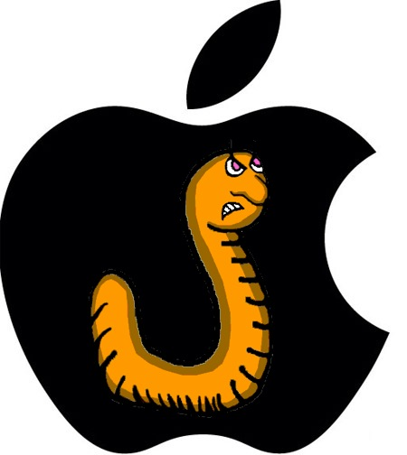

[**Intego تحذر من انتشار برمجية خبيثة تصاحب تطبيقات تخص نظام Mac OSX**](https://www.it-scoop.com/2010/06/spyware-spreads-on-mac-os-x/ )

نشرت مجموعة أمنية مختصة تسمى [Intego](http://www.intego.com/) يوم الثلاثاء الماضي قائمة بأسماء التطبيقات المصابة بالبرمجية الخبيثة OSX/OpinionSpy.

نبهت المجموعة بأن البرمجية الخبيثة ليست مضمنة في هذه التطبيقات وإنما يتم تحميلها أثناء عملية التنصيب.

تدعي Intego بأنها اكتشفت برنامج تجسس مثبت من قبل عدد من التطبيقات المجانية و شاشات التوقف screen savers الخاصة بنظام Mac والمنشورة على الإنترنت، لكنها لم تصرح عن معلومات أكثر و وفقاً للمجموعة فإن برنامج التجسس يتم تثبيته تحت المسمى "PremierOpinion".

يقوم برنامج التجسس بعدد من العمليات الخبيثة، من فحص الملفات إلى تسجيل نشاط المستخدم بالإضافة إلى إرسال معلومات حول هذا النشاط إلى خوادم عبر الإنترنت وفتح منفذ خفي في أنظمة الأجهزة المصابة.

للإطلاع على تفاصيل أوفى حول الموضوع يمكن مراجعة التحذير الذي نشرته Intego من [هنا](http://www.intego.com/news/osx-opinionspy-spyware-installed-by-freely-distributed-mac-applications.asp)، أو قراءة تدوينتها حول هذا الموضوع من [هنا](http://blog.intego.com/2010/06/01/intego-security-alert-osxopinionspy-spyware-installed-by-freely-distributed-mac-applications/).
