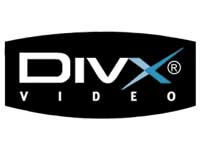

[**Sonic Solutions تشتري شركة DivX Inc مقابل 322 مليون دولار**](https://www.it-scoop.com/2010/06/sonic-to-acquire-divx/)

أعلنت شركة Sonic Solutions توصلها لاتفاق مع شركة DivX Inc المالكة لمعيار ملفات الفيديو المضغوطة DivX مقابل 320 مليون دولار.

عملية الشراء هذه جاءت بعد أن عرضت Sonic Solutions على مساهمي شركة DivX Inc مبلغ 9.83 دولار للسهم الواحد و هو ما يمثل زيادة قدرت بـ 41% من سعر السهم في البورصة، لكن هذا لا يعني إنهاء الصفقة، حيث يجب أن تحصل على مباركة السلطات المراقبة للمنافسة و الاحتكار. و من المتوقع أن تتم الصفقة خلال شهر سبتمبر القادم.

للتذكير فإنه تم إنشاء معيار ملفات الفيديو المضغوطة DivX و الذي هو سبب شراء Sonic Solutions لـ DivX Inc سنة 1999  و ساهم في انتشاره استعماله الكبير لتقاسم ملفات الفيديو على شبكات P2P.

يمكن الإطلاع على البيان الصحفي الخاص بعملية شراء  Sonic Solutions  لـ DivX Inc من [هنا](http://www.sonic.com/about/press/news/2010/06/sonic-acquire-divx.aspx)
