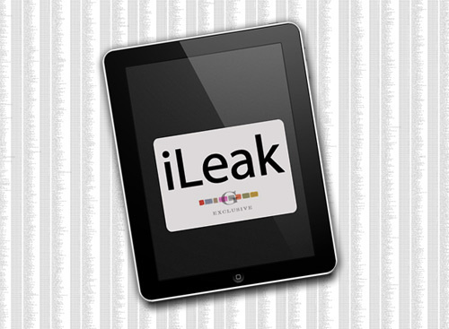
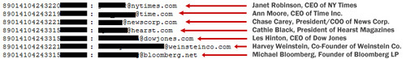
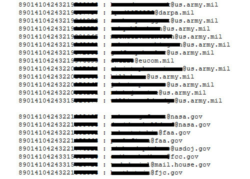
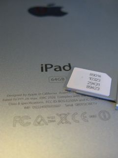

**[خرق أمني لدى AT&T يؤدي إلى سرقة بيانات 114,067 مستخدم لشبكة 3G في الولايات المتحدة الأمريكية](https://www.it-scoop.com/2010/06/at-t-lets-114000-email-addresses-ipad-owners-leak-out)**

تعرضت شركتا AT&T و Apple إلى خرق أمني كبير جداً اليوم، أدى إلى سرقة ونشر بيانات اتصال أكثر من 114,000 مستخدم لشبكة 3G على جهاز iPad الخاص بـ Apple – وربما أكثر من هذا الرقم بكثير.

و[وفقاً لشبكة Gawker الإخبارية](http://gawker.com/5559346/) التي تلقت بلاغاً من المخترقين، فإن القائمة التي حصلت عليها تضم:

<blockquote>مجموعة من مستخدمي شبكة 3G على جهاز iPad والتي تضم آلاف الشخصيات المرموقة في عالم المال، السياسة والإعلام، بدءً من الرئيس التنفيذي لصحيفة الـ Times الأمريكية Janet Robinson إلى Diane Sawyer من ABC News إلى الممثل Harvey Weinstein والمحافظ Michael Bloomberg. على ما يبدو فإن [Rahm Emanuel](http://en.wikipedia.org/wiki/Rahm_Emanuel) رئيس الأركان في البيت الأبيض و الكولونيل [William Eldredge](http://www.ellsworth.af.mil/library/biographies/bio.asp?id=12557) الذي يرأس أكبر مجموعة قاذفات B-1 الاستراتيجية في سلاح الجو الأمريكي، كان  من ضمن هذه المجموعة!</blockquote>

وفقاً للبيانات المرسلة إلى Gawker من قبل المخترقين الذين تسللوا إلى شبكة AT&T واستطاعوا سرقتها فإن  ما لا يقل عن 114,000 حساب تعرضت للاختراق، دون أن ننسى أنه من المحتمل أن تكون هناك بيانات سرية خاصة بكل فرد يملك iPad مشترك في خدمة 3G في الولايات المتحدة قد تعرضت للسرقة أيضاً.

ردت AT&T على هذه الأنباء بمحاولة لتخفيف خطورتها حيث ذكرت بأن البيانات الوحيدة التي استطاعوا سرقتها من اختراقهم هي عناوين البريد الالكتروني، وبأن هذه المشكلة كانت على قائمة أولوياتهم القصوى وتم حلّها وإيقاف الجزئية المسؤولة عنها يوم الثلاثاء المنصرم.

**تفاصيل الاختراق: من فعلها، وكيف..**

قامت مجموعة تطلق على نفسها اسم [Goatse Security](http://security.goatse.fr/) بنسب هذه العملية إلى نفسها، وفقاً لـ Gawker. ذات المجموعة كانت قد أعلنت في وقت سابق من هذا العام عن اكتشاف ثغرات في متصفحي Firefox و Safari ولفتت انتباه الإعلام في وقت سابق إلى ما قالت عنه أخطاء في نظام التقييم في مجتمع Amazon.

استطاعت مجموعة Goatse الأمنية الحصول على البيانات من خلال سكربت موجود على موقع AT&T, والذي يمكن لأي كان الوصول إليه على الانترنت. السكربت، عندما يتم تزويده بـ ICC-ID (Integrated Circuit Card ID) - في هذه الحالة الرقم التسلسلي للرقاقة الالكترونية المدمجة المستخدمة في أجهزة iPad – كجزء من عملية طلب HTTP، فإنه سيعيد عنوان البريد الالكتروني الخاص بصاحب هذا الجهاز، فيما يبدو أن الغرض منه أن يكون رد AJAX ضمن تطبيق الويب.

الباحثون في Goatse استطاعوا تخمين عدد كبير من أرقام ICC-ID من خلال النظر إلى جزء من الأرقام المعروفة [كالمنشورة من قبل محبّي هذه الأدوات على Flicker مثلاً](http://www.flickr.com/photos/kalleboo/4662852294/) ومواقع الإنترنت الأخرى.

لجعل سيرفرات AT&T ترد على هذه الطلبات، قامت المجموعة بإرسال ترويسة User Agent مزورة تقلّد فيها الترويسة الخاصة بـ iPad. هذه الترويسة تصرح عن نوع المتصفح المستخدم من قبل المستخدم عند زيارة الموقع.

نهاية، قامت المجموعة بكتابة سكربت PHP ليقوم بأتمتة عملية حصد وجمع هذه البيانات. يقول أحد أعضاء المجموعة بأن السكربت تمت مشاركته مع جهات أخرى قبل أن تقوم AT&T بإغلاق الثغرة، ومن غير المعروف فعلياً الأيدي التي وقع فيها قبل أن تتصرف الشركة بسرعة.

بصراحة هذا أحد أكبر الإحراجات التي تتعرض لها Apple – لا يمكن أن نلقي اللوم عليها لكنها تتحمل جزءً كبيراً منه لكون المستخدمين مرغمين على إدخال عناوين البريد الالكتروني الخاصة بهم حين التسجيل بخدمة 3G لدى مزود خدمة مثل AT&T دون أن يكون لهم حق رفض هذا الأمر.

كيف يمكن أن يكون ردّك لو أن اسمك كان من ضمن قائمة الأسماء هذه؟ وما رأيك في أن مزود خدمة عملاق مثل AT&T يتعرض لهذه النكسة بأبسط طريقة ممكنة ؟
