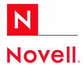

**[محكمة أمريكية تؤكد من جديد ملكية Novell لـ Unix، في القضية التي رفعتها ضدها SCO](it-scoop.com/2010/06/Novell-wins-final-judgment-SCO)**

قضت محكمة ولاية Utah الأمريكية من جديد لصالح شركة Novell في القضية التي رفعتها ضدها منذ 7 سنوات SCO Group و التي تطالب فيها بملكيتها لـ Unix.

و بينت المحكمة مرة أخرى أن Novell لم تتنازل عن حقوقها الخاصة بـ Unix لما قامت ببيعه لـ SCO  سنة 1995 مثلما تدعيه هذه الأخيرة،

لم تصدر عن SCO أية تعليقات عن الحكم الجديد، في حين اغتنمت Novell الفرصة لتهنئ نفسها  بهذا الانتصار و إغلاق الملف "نهائيا" و ببقاء Unix حرا و مفتوحا.

من الجدير بالذكر أن قراران مشابهان صدرا خلال سنة 2007 و خلال شهر مارس المنصرم و اللذان كان من المفترض بهما غلق الملف نهائيا، لكن SCO استأنفت القرار، مما يوحي بأن مسلسل SCO/Novell قد يشهد موسما قادما.

يمكن قراءة تدوينة Novell حول القرار من [هنا](http://www.novell.com/prblogs/?p=2648).
